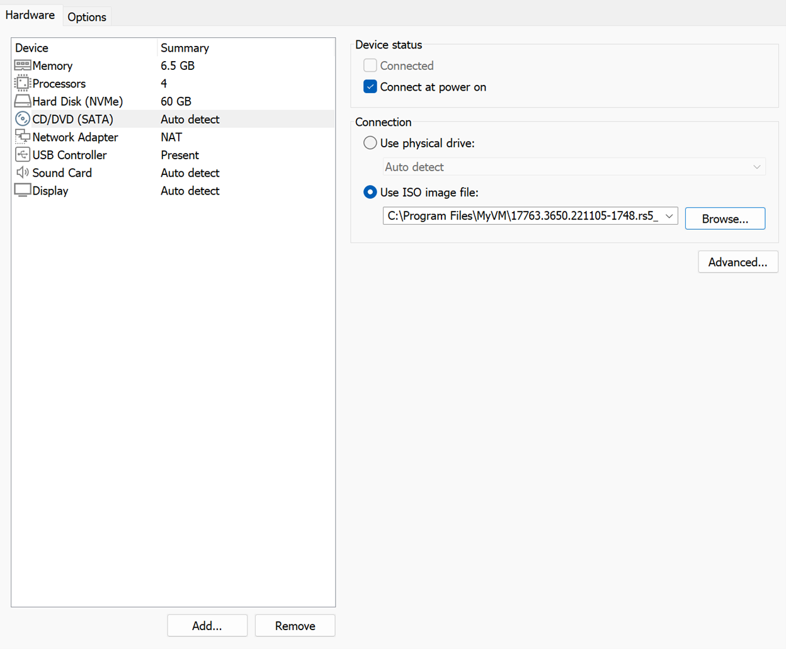
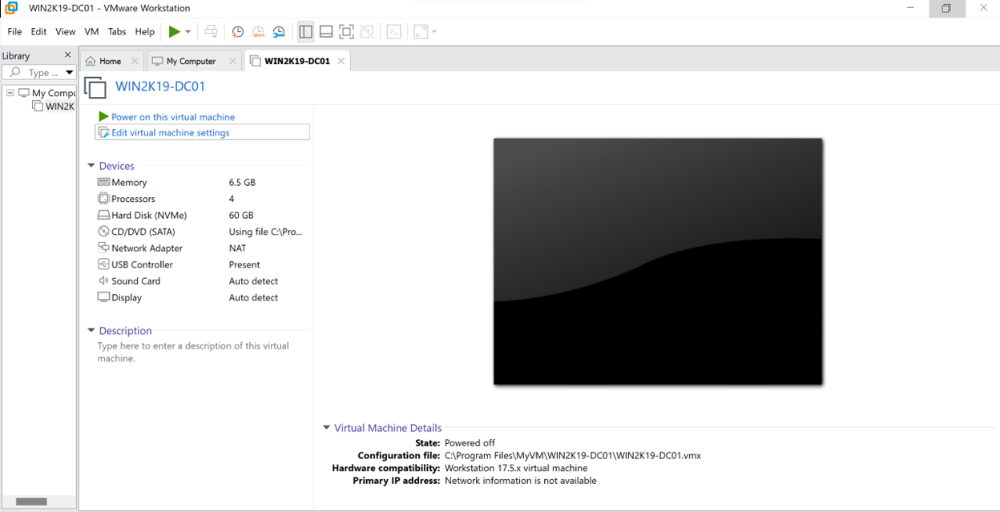
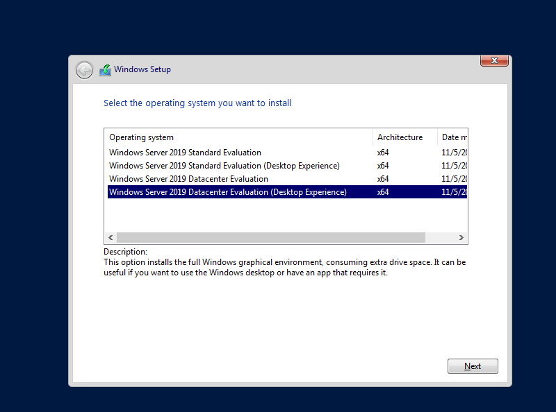
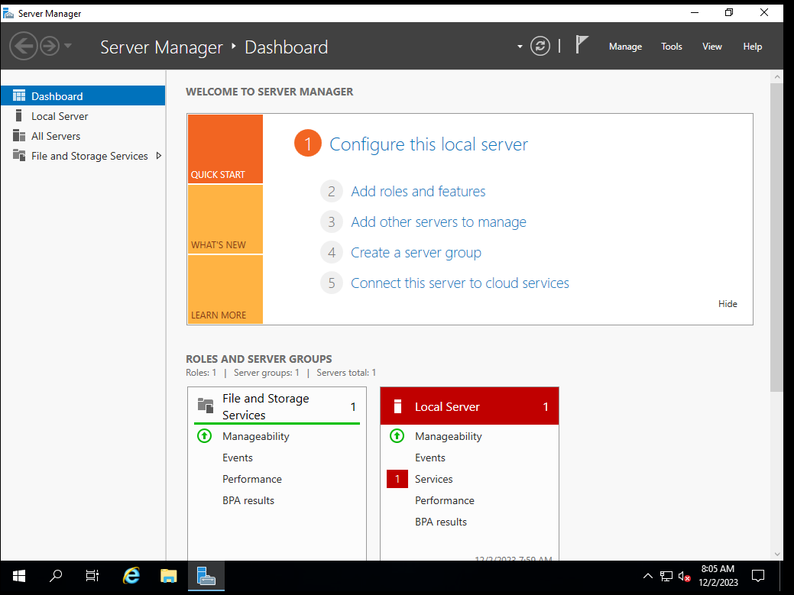
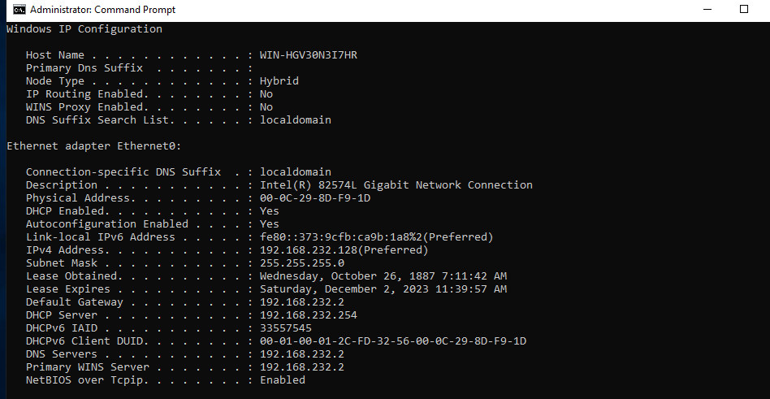
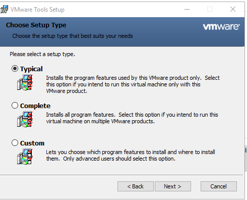
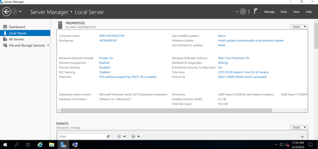

# Installing VMWare Workstation and setting up Windows Server 2019

In this step I will be installing Windows Server 2019 Datacenter in VMWare

## *Installing and setting up VMWare*

1. Was able to download and set up VMWare Workstation Pro version 17.5
2.	Able to get the ISO of Windows Server 2019
3.	In the settings of the new VM, gave the machine 6.5GB of RAM, 60GB of storage, 4 processors, and linked the ISO to the CD
4. 

## *Try to create VM*

#### Issue encountered: unable to create VM due to no permission

1.	Error message: Unable to create a new virtual machine: No permission to perform this operation

Attempt to fix: 

1.	Since this is a Windows host machine, I am thinking that VMware does not have the administrative rights to create the VM, so I gave it permission by launching it as an administrator. 

2. I put the VMs in the Program Files directory in C drive, so it will require admin privilege to make edits
3. I have since moved the VMs to my external SSD

#### Attempt one was able to fix the issue and the VM is now created

## *Installing Windows Server 2019 to the VM*
1.	Boot the OS from CD, and go on completing the normal Windows installation process
2.	Selected Windows Server2019 Datacenter Evaluation (Desktop Experience)
    - Boot the OS from CD, and go on completing the normal Windows installation process
    - Selected Windows Server2019 Datacenter Evaluation (Desktop Experience)
    - 
        - It will then do the set up on its own
    - It will ask me to create an Admin password, I did, and I am not gonna tell you what it is
    - Logged in to the server and the first thing that pops up is the Server Manager, as it should
    - 
    - Checking the installation
        - Checking to see if the IP address is on my local home network
        - 
        - It looks like it is on my local home network
        - Will be doing the scope for the VM later when I am doing configurations

## Installing VMware tools so it has the utilities and drivers to enhance the performance and user experience of the VM
1. 
2. Select Typical type
3. It will do its thing, and then it will ask me to reboot the VM
4. After everything is done, the VM display looks a lot bigger

## Changing the name of the VM
1. Do it in the Server Manager
2. 
3. Changed the name to WIN2K19-DC01
    - This is meant to be my Domain Controller
4. After the restart, the name change will be done

