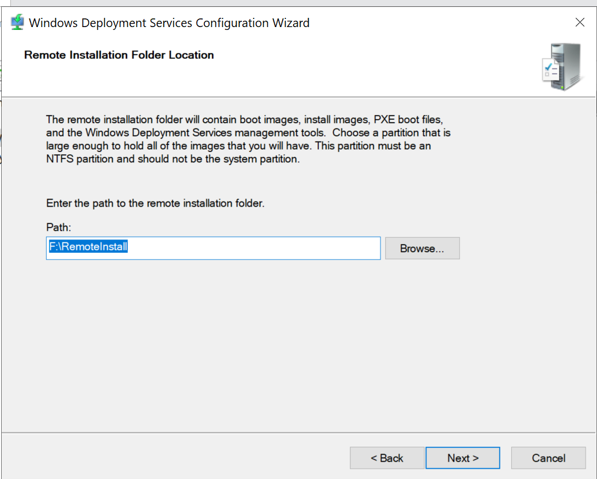
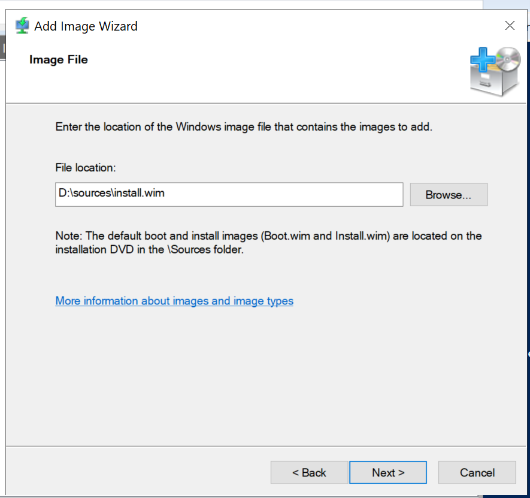
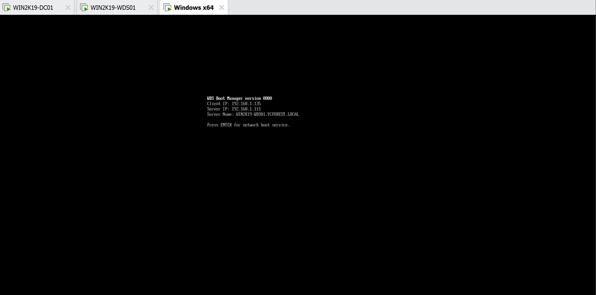

# Installing and Configuring Windows Deployment Server

In this step I will beinstalling and configuting Windows Deployment Server to a new VM(WIN2K19-WDS01) in the domain

## *Installing Windows server for further configurations, and add roles and features to the new VM*

Setting up the new server and adding the WDS role on the new server

1.	Configure the Windows Deployment Service server, named it WIN2K19-WDS01, assigned it with the IP address of 192.168.1.111, and joined it to the domain
2.	Add roles and features on the soon WDS server
3.	This will be a role based feature
4.	Select this server(WIN2K19-WDS01) to add the feature
5.	Select Windows Deployment Service at the Select Server Roles section
6.	This will be a transport and a deployment server
    - This will be its stand-alone server, we are not installing any other roles in the server
    - You can install WDS roles and features on a Domain Controller, but it is better to install it as a stand-alone server if you have the resources to spare since it will yield better performance overall
7.	Install the roles
8.  Add a new disk to the VM
    -   To store all the image files that will be used for the boot environment
    -	Allocate an extra 60 GB for the server as another disk
    -	At the server, use disk management to get that added disk online and make a simple volume from the disk using all 60GB
    -	The drive letter will be F
    -	This disk volume will now be the disk volume that stores our images for the deployment
9.	Create a new scope option in our DHCP(which is my main domain controller in this case)
    - This is important for setting up PXE boot, because it allows the client to know where to pull the image from
    - Open up DHCP in server manager
    - Go to IPv4 after selecting the DHCP server
    - Double click on the scope that we made earlier
    - Select scope options
    - Make a new scope option by right clicking on the scope options folder and select configure scope options
    - Find option 66: Boot Server Host Name and type in the full host name on the data entry field
    - 
    - Find and select option 67: bootfile name and type in boot\x64\wdsnbp.com
    - 
    - Then select apply and ok
    - Scope option for the WDS server and the boot file are created, which creates a PXE environment

Basic configuration for the VM and environment is done, so we can move on to further configure the boot environment

## *Configuring the WDS server*

Further configure the Windows Deployment Server

1.	Go to the server manager of the WDS server that we installed earlier
2.	The left panel now shows the WDS option
3.	At the server list, there should only be one server in the list, which is this one
4. 
5. Right click on the server on the server list, and select Windows Deployment Services Management Console
6.	Select this server from the servers list under the Windows Deployment Services option, and we were shown that the WDS is not configured
7.	Right click on our only server and select configure server and bring up the Windows Deployment Services Configuration wizard
    - 
8.	Integrate with Active Directory
9.	The remote installation folder location will be in the F drive that we set up earlier
    - 
10.	Respond to client computers, known and unknown
11.	It will be doing its set up right now
12.	After the configuration wizard has done its thing, the F drive has all these files and folders appeared
    - 
    - 
        - Inside the auto-generated RemoteInstall folder

## *Add image files to the Windows Deployment Server*

Extracting the Windows server image from the Windows Server 2019 ISO, and add them to the Windows Deployment Server for future deployment

1.	Go to VMware settings for WIN2K19-WDS01 and select the CD/DVD section, and then select use ISO file
    - This will allow the Windows Server 2019 ISO file to show up as a DVD in the file explorer WIN2K19-WDS
    - We need this ISO to add the image files to the Windows Deployment Services
    - At the ISO file selection, select the ISO of the operating system that you want to install and select open
    - This will mount the ISO of the operating system as a DVD drive on the VM
        - 
2. It is now time to add those image files sto the Windows Deployment Services
3. At the Install Images folder of the Windows Deployment Services configuration window of the WDS server, right click the Install Images folder, and select Add Install Image
4. Add image wizard appears
    - 
    - Add image wizard appears, and we are creating a new image group called WIN2K19-Image
5. Select install.wim from the sources folder of the DVD drive
    - 
6.	All the available images will be selected which is fine
    - 
7. Add the images
8. The images will now appear in the image group after finish adding it
    - 
9. Add boot images
    -	Right click on the boot images folder and select add image
    -	Go to the sources folder of the DVD drive and select boot.wim
10.	Leave the server name and description as default
11.	The image will appear in the boot image folder after it is added
    - 

At this point, the Windows Deployment Services have been set up for this domain, and we will do a test deploy to see whether or not it actually works

## *Do a test deploy on a new VM*

We have set up the Windows Deployment Services on the WIN2K19-WDS01 server to do PXE boot, now it is time to see whether or not the PXE boot that we set up actually works by doing a test deploy on a new VM

1.	Install a new Windows server using PXE boot from this new WDS server that we set up to test its functions
2.	Created a new windows VM but did not install the OS
3.	Power it on and instead of clicking any key for the disk installation like we used to, we let it try to find the PXE boot by not touching it at all
4.	It did found it
    - 
5.	Hit enter like it instructed and let it do its thing
6.	After it finished getting the files required, it will ask me to provide the domain credentials to start installing the OS
    - 
7.	Then it will just be a normal installation of Windows Server, or whatever OS you are trying to set up
8.	After the installation process, the VM is already joined to the domain
    - 
    - 
9.	And it is shown in Active Directory
    - 
    - The computer name is defaulted to Administrator1
10. Now we have our Window Deployment Services set up, which means we can automate a lot of the process on setting up servers.

## We can now confirm that our Windows Deployment Server is working properly