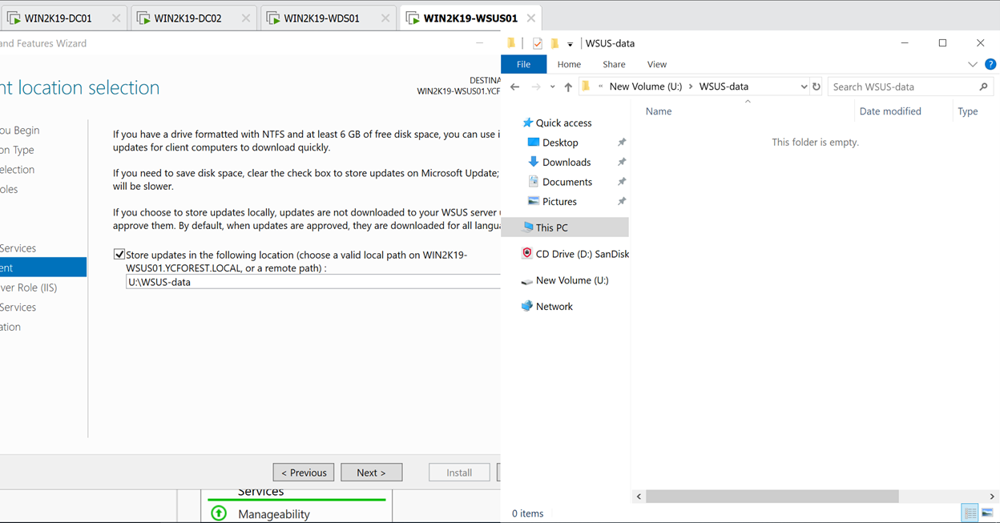
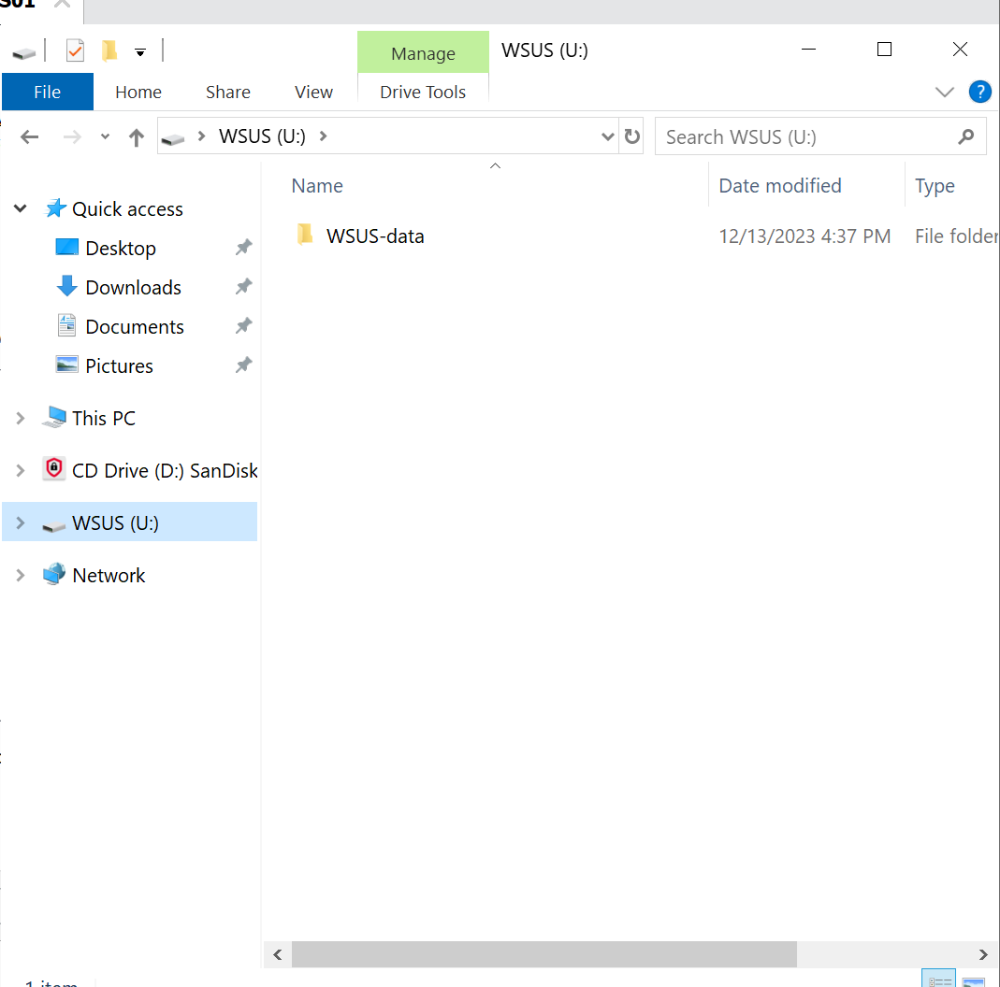
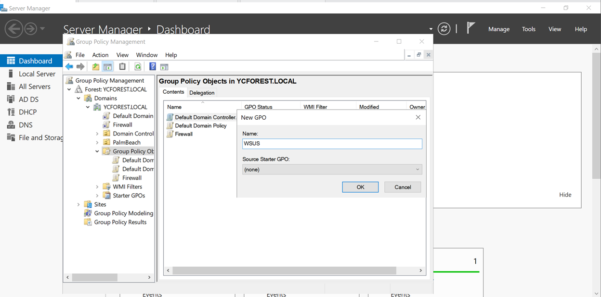
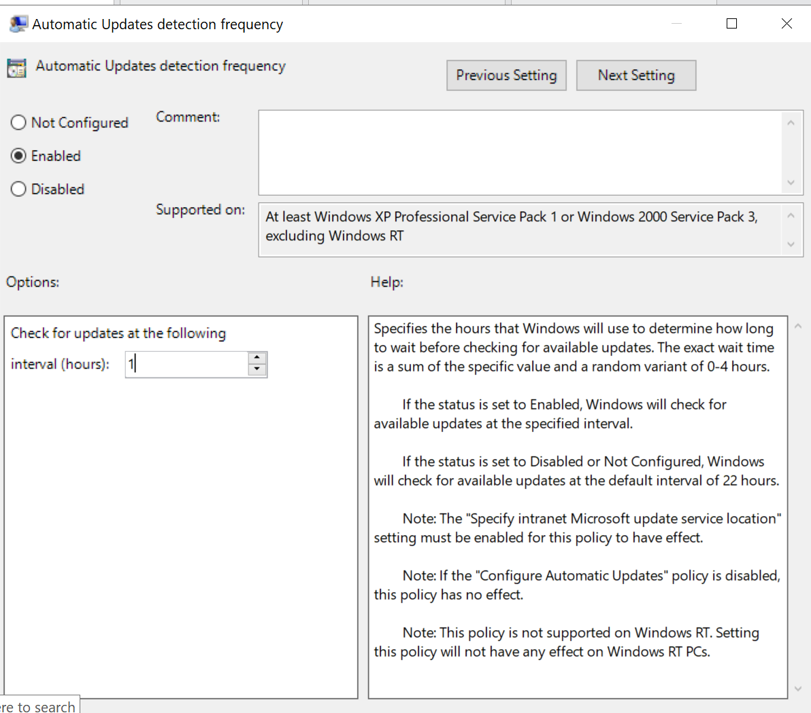
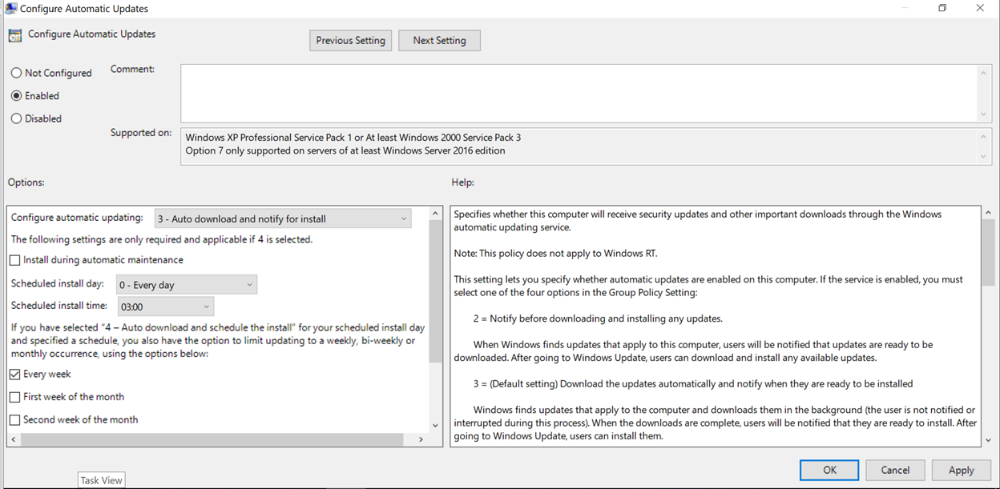
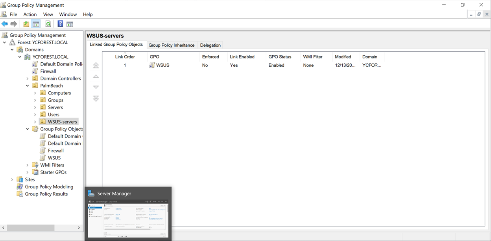
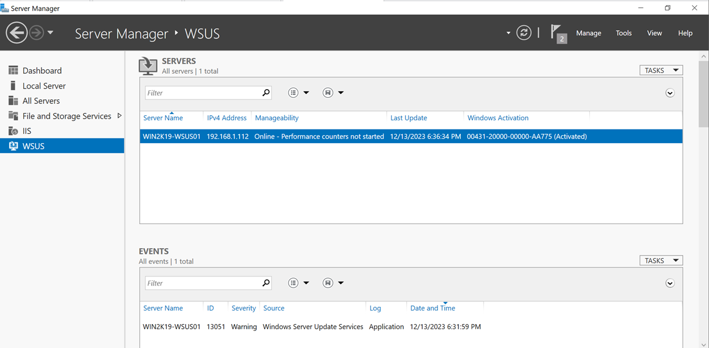
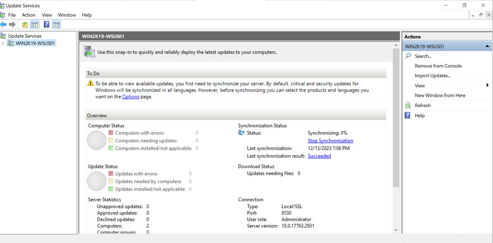
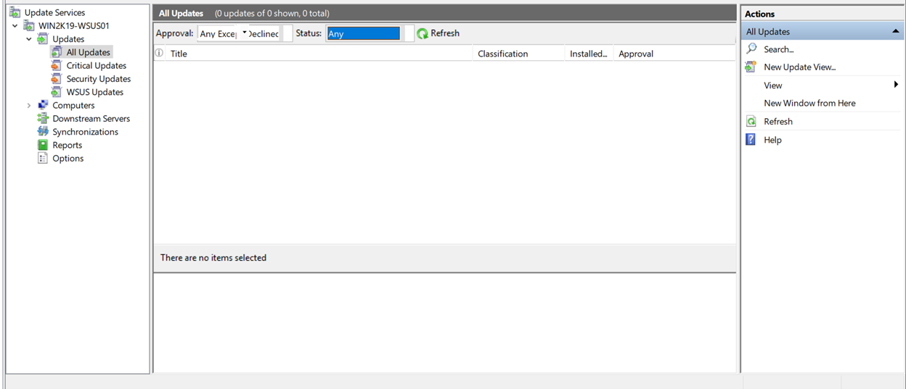
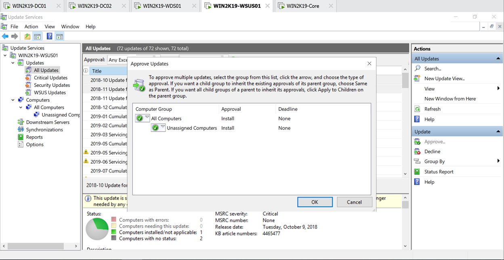

# Install WSUS(Windows Update Service) Server for the domain

In this step I will be configuring Windows Update Services on the server WIN2K19-WSUS01

## *Basic server configurations and add roles and services to the server*

Set up the WIN2K19-WSUS01 server and install the Windows Server Update services roles to the server

1. Configure the IP address and join it to the domain(like all VMs)
    - The IP address is 192.168.1.112
    - The name of the server will WIN2K19-WSUS01
2. Add roles and features
    - Roles based features
    - Windows Server update features
3.  Install the WID Connectivity and WSUS Services
    - WID Connectivity: Windows database connectivity
    - WSUS Services: installs the services that will be used by Windows Update Service(WSUS)
4. Create another drive to store the update content(mine will be an U drive and named it WSUS) and specify the path to the Roles and features wizard
5. In the new drive, create a folder called WSUS-data and add the path of the folder to the wizard
    - 
6. The drive is now named WSUS, not new volume
    - 
    - Renamed the drive to WSUS
7. The WSUS-data folder in the new U drive will be where all the updates and content is going to be resided
8.	Leave the rest as defaults and install the roles and features

## *Configure WSUS and Group Policy for the servers*

Configure the WSUS services and create group policies to allow deployment of updates to domain servers

1. At the main domain controller Group Policy Manager, create a new group policy name WSUS under the domain YCFOREST.LOCAL of the forest YCFOREST.LOCAL
    - 
2. Right click on the new WSUS policy after its creation and edit it
3. Go to
    - Computer configuration
    - Policies
    - Administrative templates
    - Windows components
    - Windows Updates
    - Select standard settings at the bottom of the Group Policy Management Editor
    - Enable automatic updates detection frequency
        - It will be 1 hour interval
        - 
4. Enable specify intranet Microsoft update service location
    - The location will be http://WIN2K19-WSUS01.YCFOREST.LOCAL:8530
    
    > http://WIN2K19-WSUS01.YCFOREST.LOCAL:8530

    - This will be the address for the service that detects updates and the statistics server
    - Port number that we are using is 8530
    - ")
5. Enable configure automatic updates
    - Option 3 for automatic update configuration
        - Auto download and notify for install
    - Leave rest to defaults
    - 
6. I set up another Organizational Unit in my PalmBeach OU in my active directory called WSUS-servers, and put my WSUS server that I am setting up and the core server named WIN2K19-Core to that OU
    - which is set up in this [Step](../step_6/README.md)
7. Link the WSUS GPO to the WSUS-servers OU
    - 
8. After the post installation set ups the Roles and Features Wizard performs on the WSUS server after the installation of the WSUS roles, we see WSUS option in Server Manager
    - 

The WSUS group policy and the WIN2K19-WSUS01 server has been created and configured, so we can deploy the updates to other servers in the domain

What we have to do next is to configure what and how the updates will be deployed

## *Configure Updates Services*

Here, we will configure updates services to controll how the updates will be deployed and which updates will be deployed

1. Go to the server manager of the WSUS server
2. Select Windows Server Update services from the tools section of the server manager and the Windows Server Updates Configuration Wizard will come out
3. Check and make sure to see if we are able to get to the internet and we have our firewall to our domain turned off
4. We don't want to join the Microsoft Update Improvement Program so uncheck that
5. We want to directly download the updates from Microsoft, so select synchronize from Microsoft Update
6. We don't have proxy server so we are not synchronizing updates with a proxy server
7. Start connecting to the Microsoft update servers to fetch the updates
8. After the connection is complete, we will move on to be selecting the language of the updates
    - Choose English
9. When selecting products to download, deselect the entire Windows section that the system already selected, and only select Windows Server 2019, because we are only doing Windows Server 2019 at this point and all other Windows 10 updates and whatnot are taking too much space
10.	The classification of the updates will be
    - Critical updates
    - Definition updates
    - Service updates
    - Basically the updates that the system selected for you by default
11.	Synchronize manually for this server, since this is a virtual environment and my computer is not going to keep the server up all the time
12. Begin the initial synchronization now and hit finish
13.	The Windows Update Services synchronization is doing its thing to synchronize the updates
    - 
14. As the synchronization progresses, there will be more updates popping up in the updates section
    - 
15.	After the synchronization is complete, we will need to approve the updates so it can be installed
16.	I will randomly approve two updates and I will approve them for all computers and unassigned computers
    - 
17.	At this point, the set up for the WSUS is pretty much done, we are just testing the update on the core server by updating the group policy
18.	Just to make sure, after running the gpupdate /force command, also run the wuauclt /detectnow to register with the WSUS server to see if there are any other updates that needs to be done

>gpupdate /force 

> wuauclt /detectnow

## WSUS server set up is complete