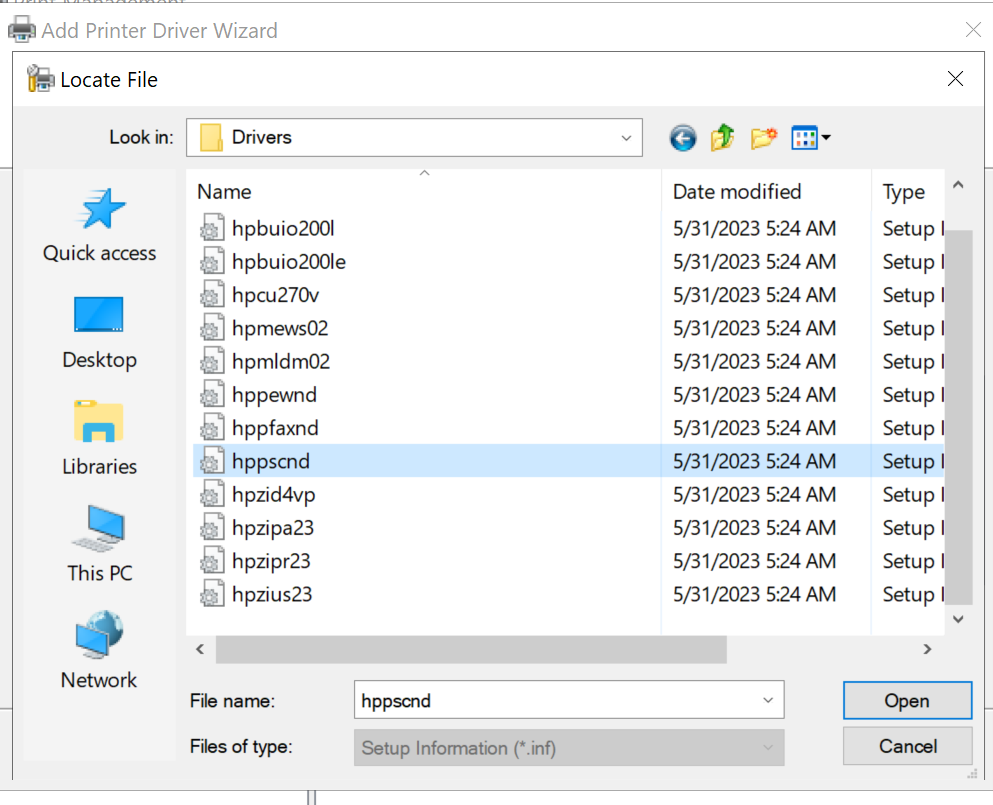
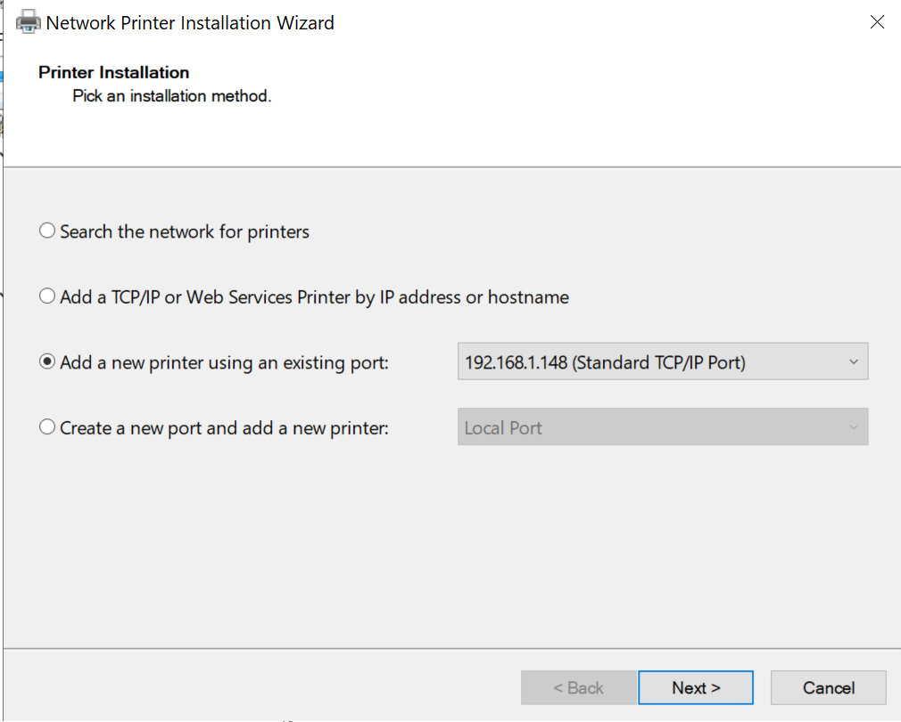
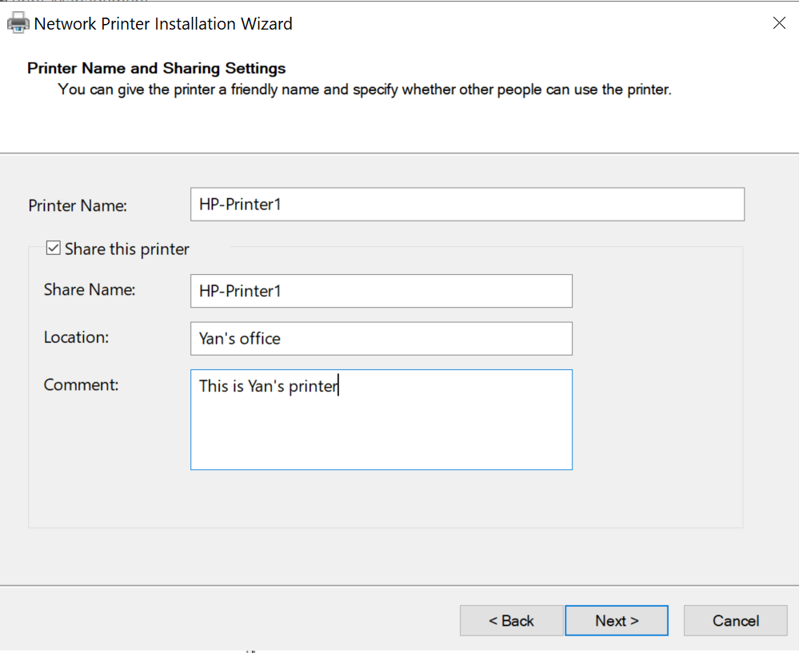

# Installing and Configuring Print server to the file server(WIN2K19-FS01) on the domain

In this step I will be print services to the file server on the domain(WIN2K19-FS01, IP address is 192.168.1.108)

The file server is set up on this [Step](../step_7/README.md)

## *Add Print and Document services for the WIN2K19-FS01(the file server)*

Adding and configuring the print and document services role for the file server

1.	We are using our file server for the server
2.	Install Print and Document services for the WIN2K19-FS01(the file server) in the Add roles and feature wizard
    - It will be a role-based feature
    - adding this to start making it a print server
    - We are installing only the print server

## *Add printer driver and configure printer management*

Add the offical printer drivers from HP and configure the printer in the printer management

Add two printer ports to the printer management with two reserved IP addresses

We do not have a real printer, but we are going to install it anyway just because

1.	Get the printer driver from a random official printer company site
    - I used the generic printer driver from HP
2.	Download it to the host machine and copy that file and paste it in the virtual machine
    - We can do it since we installed VMWare tools
    - 
    - Printer driver is now in the C drive of WIN2K19-FS01
    - The driver will still be pulled by the client machine, so we can still go through the process even if we do not have a printer in our network
3. Pull up printer management from the server manager of WIN2K19-FS01 after the installation is completed
4. Add the printer IP address to the local print server(WIN2K19-FS01) port
    - The port will be a TCP/IP port, and address will be 192.168.1.148, and the name will be the same as well
    - This is address is outside of our DHCP ranged that we have set for our DHCP address pool
    - Even though the printers do not exist, I can still add them
5.	The server is never going to find this port because it is not assigned to a single machine in our network, let alone a printer, but we will install the printer on the printer server like it existed
6. The wizard will let us proceed even if it cannot find the printer
    - 
7. Continue with a generic network card
8. First port is now finished setting up
    - 
9.	Add another TCP port and this time the port name and address will be 192.168.1.149
    - Same process as the first port
    - Both ports are now showing up in the ports section of the printer management
    - 

## *Add printer to the printer management*

Add printer drivers to printer management and correspond that with the intended port

Add and configure the printers

1.	In the add drivers to the drivers unit of the local server
2.	From the drivers that I have imported from my host machine, select a driver that you liked
    - 
    - Select the driver that fits
3. Select one of these and hit next
    - 
4. The printer driver that we have selected
    - 
5. There is the driver that we added
    - 
6.	In the printers unit, right click and select add printer to bring up the network installation wizard
7. The select add a new printer using an existing port and select the 192.168.1.148, the port that we set up in the earlier steps
    - 
8. Select use an existing printer driver in the computer and select the HP Universal Printer PS(v.7.1.0)
    - 
9. Give the printer a printer and shared name of HP-Printer1, and left it some description and comments, then hit next and let it install
    - 
10. It will ask you for another printer or doing a test print on this printer after it finishes. Just select finish because this printer does not really exist
11. List printer in directory
    - After the installation is done, the printer will show up in the printers list of the local server
    - Right click on the printer and open up the properties of the printer, then under the sharing option, select and check share this printer, render print jobs in client computers, and list in the directory
        - 
        - This step will allow the printer to show up in the domain active directory and be seen by client machines in the domain and allow them to connect to it
12. Set up another printer and named it with the share and printer name of HP-Printer2 using the same process and the 192.168.1.149, which is another address that is out of the scope of DHCP server that we have set up earlier
    - 

## *Add printer to the a client computer*

**Add the printer to the client computers in the domain**

Add printers using control panel
1. Opened up WIN2K19-Client1, which is a Windows 10 client machine that I have added to the YCFOREST domain 
2. Go to the control panel devices and printers page and select add a printer
3.	The client computer will look for printers in the network that are available to add
4.	Two of the printers that we added on to the printer server will be showing
    - 
5. Click on the one that you want to add, I will personally select HP-Printer 1 in this case, and hit next
6. The installation will begin, and after it is done, the printer will appear in the printer section of the devices and printers page
    - 

**Add printers using the run command**

1.	Using the run and in the Open field, type in the name of the print sever with \\ in front of it. (\\WIN2K19-FS01\   in this case)

> \\WIN2k19-FS01\

- 
    - The UserData share is showing because WIN2K19-FS01 is also serving as our file server, and UserData is our shared folder

2. After selecting ok, a page will come up with all the printers that are installed in the print server
3. Double click on the printer you want to install(I will do HP-Printer2 this time), it will go through the installation process on its own and the printer will show up in the Devices and Printers section of the control panel
    - 
4. This is it for installing and configuring the print server, and install the printers to a client machine via the print server.
5.	It will go through the connection, and send a print job to it, but it is just not going print since the printer never exited.

## *Deploy Printer using group policy*

We will be deploying two group policies to deploy the two printers that we just set up(HP-Printer1 and HP-Printer2) automatically to our client machines

1.	In the main domain controller, open up active directory users and computers, and under the Palm Beach organization unit of the YCFOREST.LOCAL domain, create two organization units, printer1 and printer2
    - 
        - Created two OUs for HP-Priner1 and HP-Printer2
2. Created three more client machine for testing purposes, and they are all Windows 10 clients that joined to the YCFOREST domain
    - WIN2K19-Client2
    - WIN2K19-Client3
    - WIN2K19-Client4
3. Printer1 will hold WIN2K19-Client2
4. Printer2 will hold WIN2K19-Client3 and WIN2K19-Client4
5. Create 2 new group policy objects called Printer1 and Printer2 using the Group Policy Management of the main domain controller, and link it to their respective Ous that has the same name
    - 
6. Go to the print server and locate HP-Printer1 and HP-Printer2
7. Select HP-Printer1, and right click on it
    - Click on deploy with group policy
    - Browse the group policies to go with the deployment, and select Printer1
    - 
        - Associate the printer1 group policy object with HP-Printer1
    - This will be a computer based group policy
    - 
        - Associated the printer1 group policy object with HP-Printer1
    - Then add the group policy with the per machine connection setting
        - 
    - Set up is done for HP-Printer1
8. Do the above steps for HP-Printer2
9.	These two printers are now showing up as the deployed printers in the printer management
    - 
        - These two printers are now showing up as deployed printers in the Print Management of WIN2K19-FS01
10. In the Group Policy Management, we can see that these two policies are linked to their respective printers in their group policy settings
    - 
        - The printer HP-Printer1 and the group policy object Printer1 are now linked
    - 
        - The printer HP-Printer2 and the group policy object Printer2 are now linked
11. The policies are now set up, next we will test it on our client machines to see if they really do deploy the printer automatically

## *Test the group policy deployment with our client machines*

We will be using our client computers to test if the group policy deployments are working as intended

1. Test if the group policy in their respective clients
    - Printer1 will have Client2
    - Printer2 will have Client3 and Client4
2. Add printer by logging in to the computer and run command prompt as administrator
    -  Type the command gpupdate /force to update the newly added group policy

    > gpupdate /force

    - After the update is complete, the printer will show up in the computer's Devices and Printers page
3. Client3 has successfully updated the group policy and added the printer
    - 
    - The group policy deployment with WIN2K19-Client3 is successful
4. Client2 has successfully updated the group policy and added the printer
    - 
    - The group policy deployment with WIN2K19-Client2 is successful
5. Client4 has successfully added the printer with the group policy update
    - 
    - The group policy deployment with WIN2K19-Client4 is successful
6. The group policy deployment is a success

### **The printer service is now added onto WIN2K19-FS01, and all of it functionalities are working as intended**