# Installing and Configuring FTP server

In this step I will be installing and configuring a FTP server onto my YCFOREST domain

The FTP server will be named WIN2K19-FTP01, and its IP address will be 192.168.1.113

## *Basic set up for the new VM and security groups*

Install the virtual machine and do some basic configurations on it to set up for future installation

Configure security group and assign user for the security group to grant those users permissions to use FTP connection of the server

1.	Set up a server in the network with the usual procedure of giving it a name(WIN2K19-FTP01), and giving it a static IP address(192.168.1.113)
2.	Create a security group in the domain controller called FTP-Group, and it will be a global security group that resides in the groups OU of the PalmBeach OU
    - 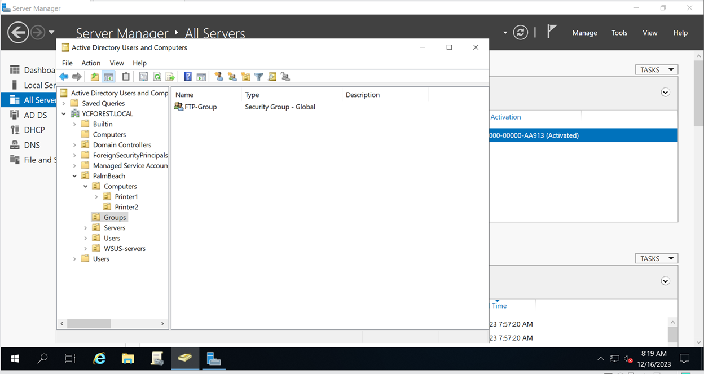
3. Add user accounts User1 and User2 into the security group	
    - 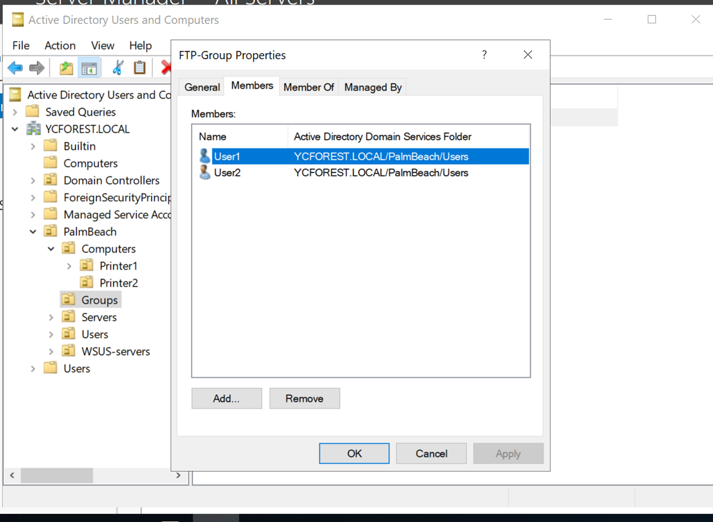
    - This will allow User1 and User2 to access the FTP server
4. Install IIS roles and features
    - This will have to be installed before installing the FTP server
    - Internet Information Services is a Windows web server that is used to exchange static and dynamic web content with internet users
    - Select FTP server in the IIS roles services selection and FTP services will automatically be chosen
    - 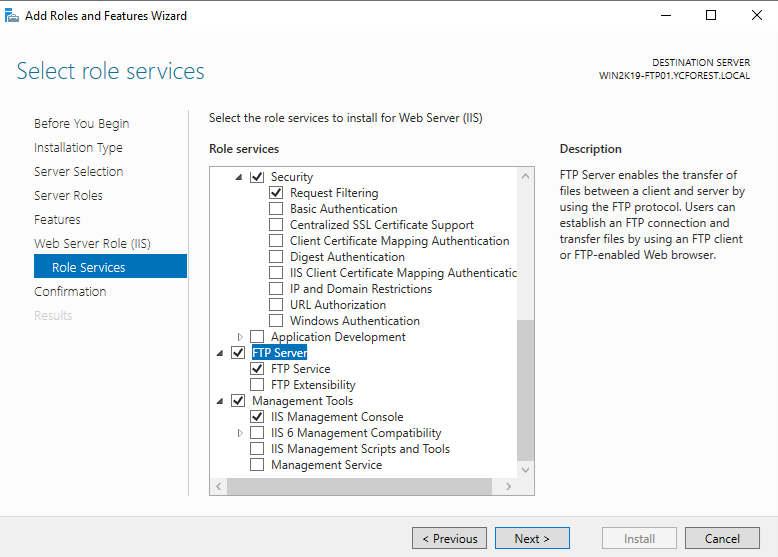
        - Add IIS roles for the server
    - Leave the rest as default and install the server roles and features

## *Configure and test FTP*

Test to see if our IIS(Intranet Information Services) is reachable and configure FTP settings

1. Open up Internet Information Services Manager
2. Select the default site under sites directory of our server to see our default site selections
    - 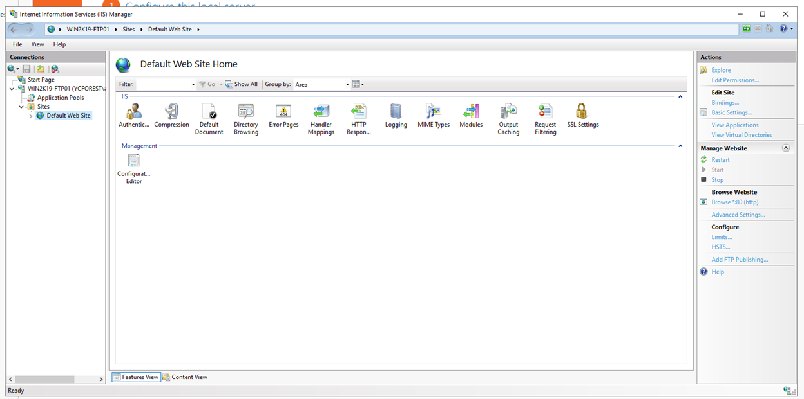
3. Go to the browser and type in the loopback address(127.0.0.1) and we should see our default site and it will mean that our IIS is up and running
    -  to see if our IIS default site is working and reachable")
4. Our IIS is up and running as well as it is reachable, so we will be doing FTP configurations next by adding a FTP site
5. Right click on sites under the WIN2K19-FTP01 server and select add sites to start adding a FTP site
    - 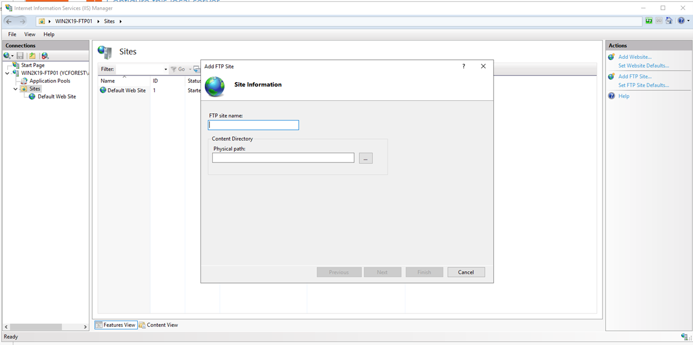
6. The site name will be FTP-YCFOREST
7. The path will be in C:\FTP-Root
    - FTP-Root is a directory that I made in the C drive and this is where all the content will go
8. The IP address will be 192.168.1.113(the IP address of the server), start the FTP site automatically, and require no SSL(too bad I don't have one right now so I have to let it have no SSL, but in a real production environment I will definitely require a SSL certificate)
    - 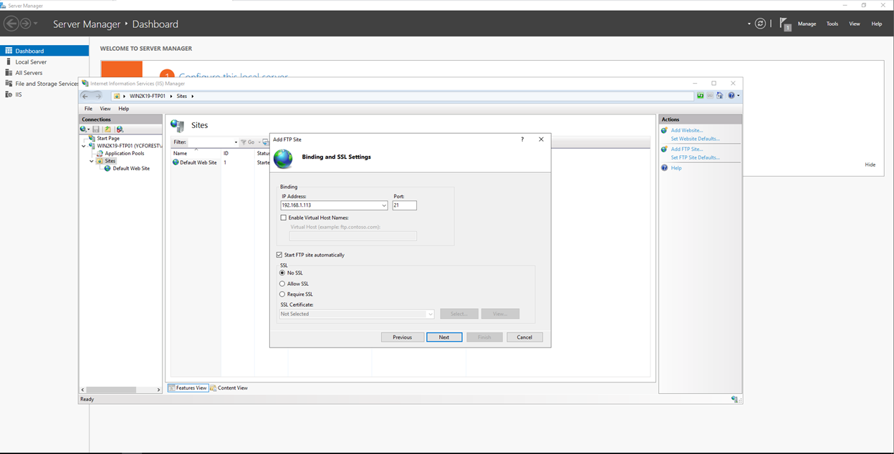
9. Basic authentication(anonymous will mean anyone can get in without credentials, and we do not want that)
10.	Give the Security Group FTP-Group permissions to read and write
    - 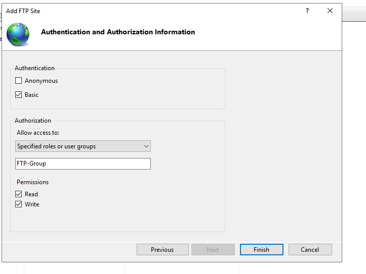
    - The users within the FTP-Group that we just created will ahve read and write permissions once they pass the basic authentication to connect to our server via FTP
11. Now the FTP site is showing up in the sites section
    - 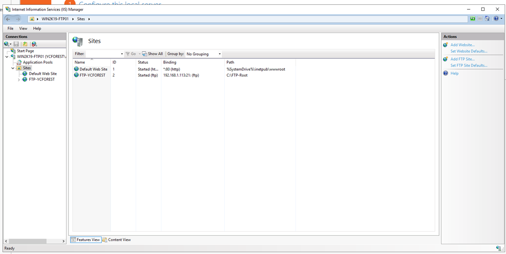
12. Test the connection of the FTP server in the Intranet Information Services Manager to see if the settings are valid
    - Click on the FTP-YCFOREST site that we just made
    - Click on the basic connections under the actions panel to the right
    - Click on test settings
    - 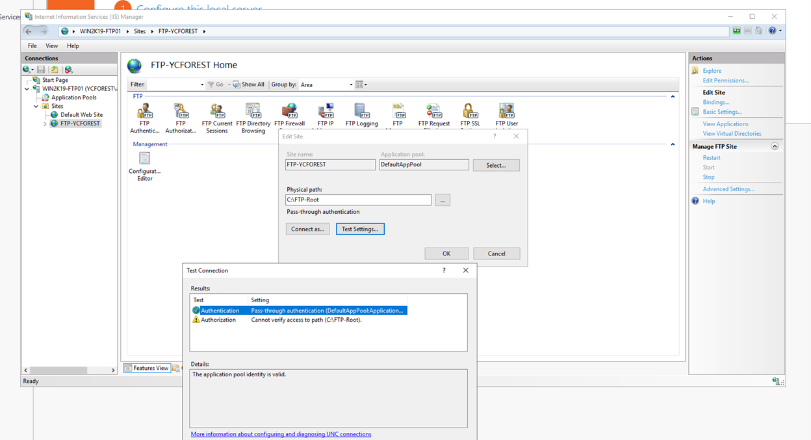
    - Looks like the connection is valid and our settings are good
    - We can ignore the Authentication error that is given to us, we will test to see if users that are assigned permission can access the FTP service in the later step

## *Test to see if users with permissions can access FTP*

We will be using a client virtual machine that is in our domain to test if users with permissions can access the FTP service of WIN2K19-FTP01

1. I have already installed FileZilla in my WIN2K19-Client2 to test out the FTP connection to the server
    - The port will be 21, as this will be the FTP port
    - The IP address will be 192.168.1.113, the address of the FTP server
    - The user will be User1 and the credentials will be the same as the User1 account in the AD, since this is the same AD account
    - This is connected now
    - 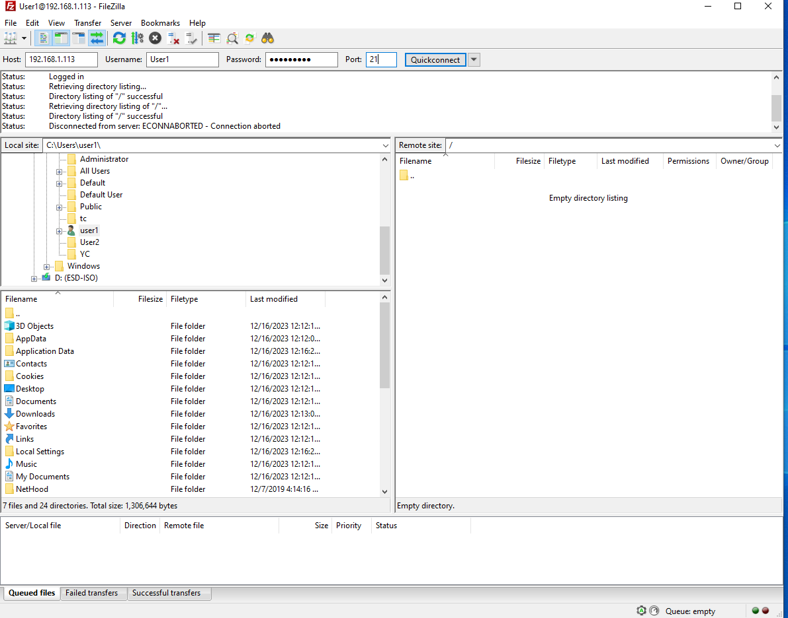
2. Created a test.txt file from the client2 machine, put some content in it, and uploaded to the FTP server via FileZilla
    - User1 should have read and write permissions, so the upload should be allowed
    - 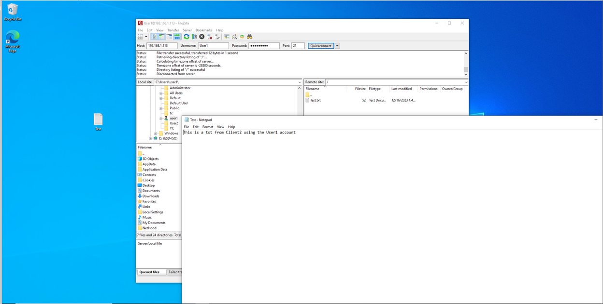
3. FTP server was able to receive the file
    - ")
    - WIN2K19-FTP01 was able to receive the file in the FTO directory that I set up(C:\FTP-Root)
4. Changed the file a little bit and then have the client2 machine download the file again
5. The client has successfully received the updated version of the file
    - 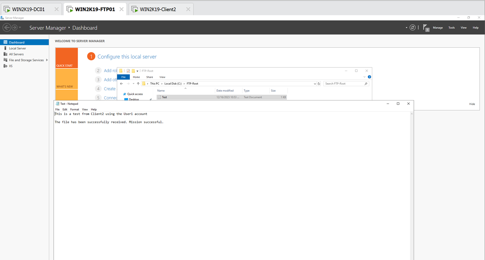
    - User1 was able to receive the updated file via FTP and download it to the client computer
6. FTP server is able to execute connection and the right permission for users

### **FTP server configuration is now successfully configured and it is functioning properly**