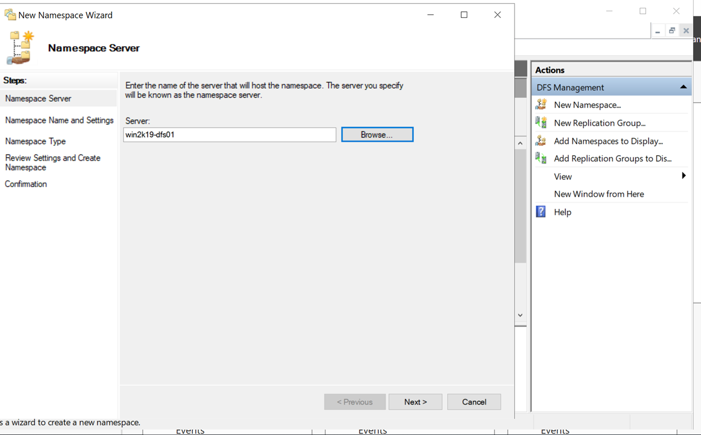
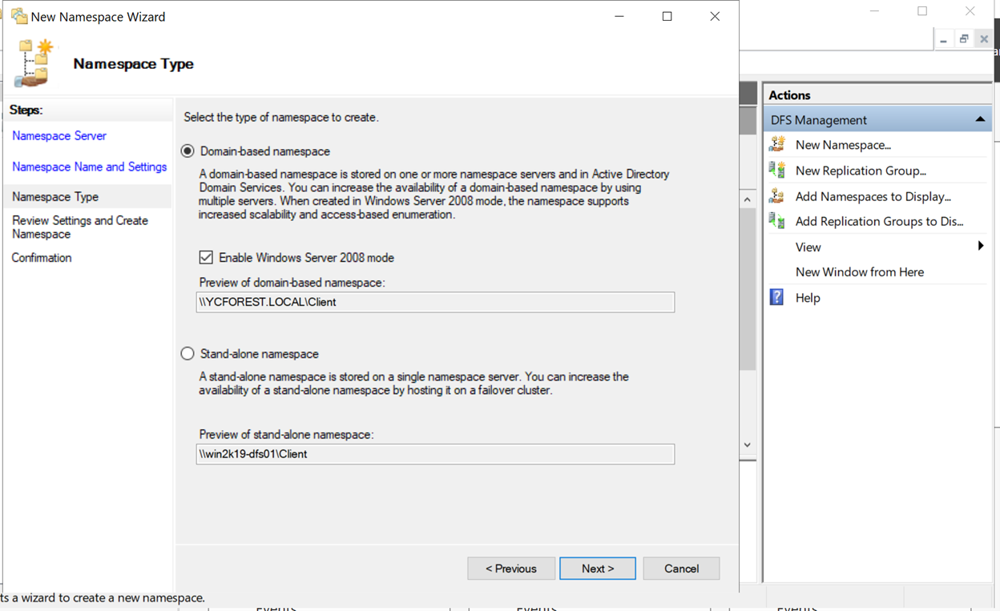
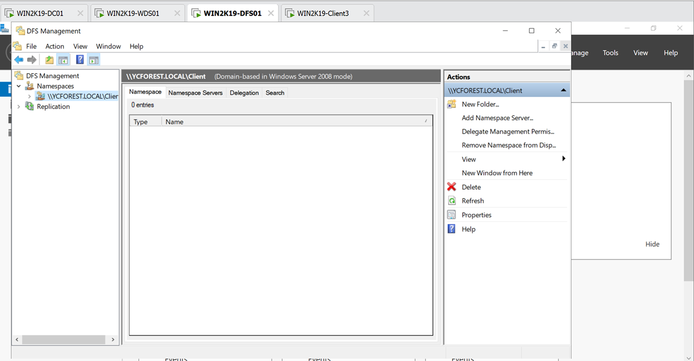
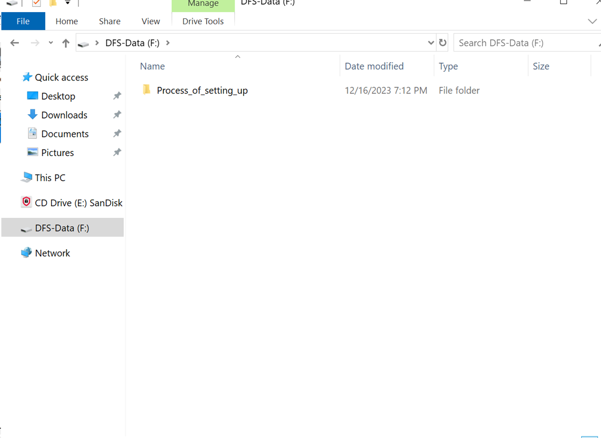
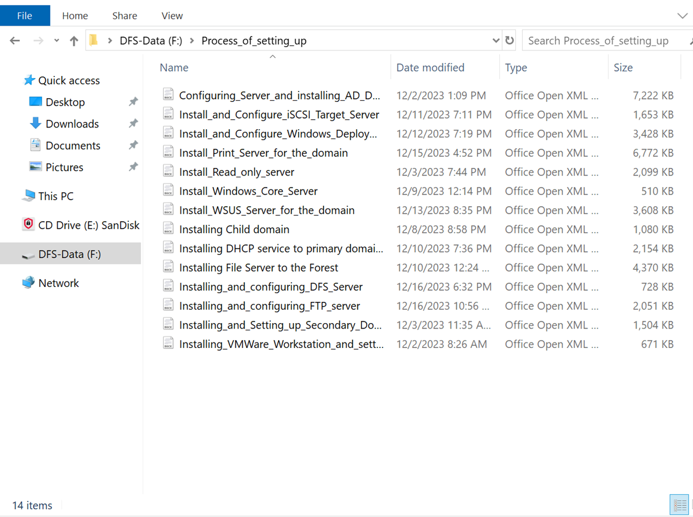
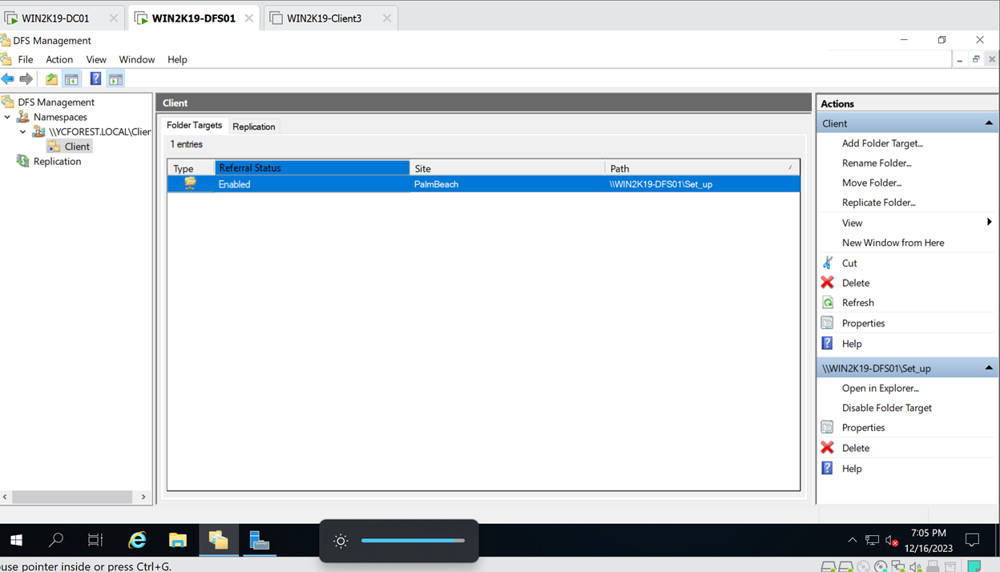
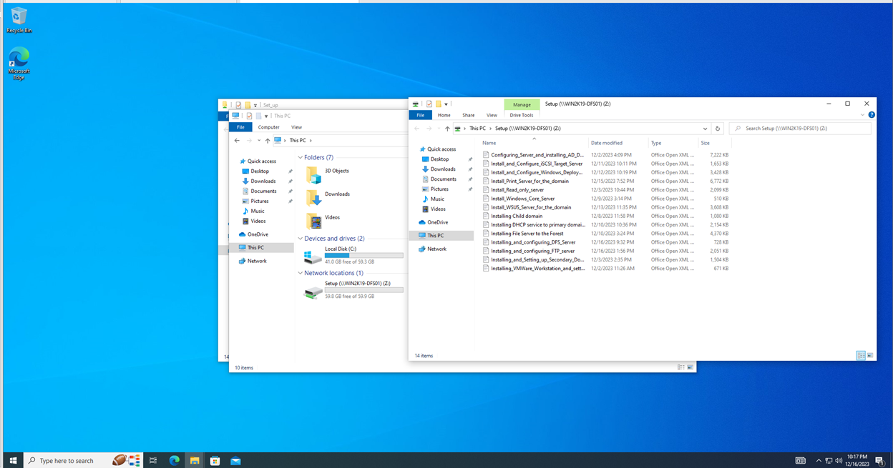

# Installing and configuring distributed file system(DFS)

In this step I will be installing and configuring a dfs server onto my YCFOREST domain

The FTP server will be named WIN2K19-DFS01, and its IP address will be 192.168.1.114

## *Basic set ups for the VM*

I have already done the basic installation of the VM

Assigned it the name WIN2K19-DFS01 and static IP of 192.168.1.114. It is joined to the domain, put it in the servers OU in active directory. 

1.	Add new DFS Namespace and DFS replication role to the new server via the Add roles and features wizard
    - DFS namespace is under File and storage services and File and iSCSI services
    - Leave the rest to default and reboot the server after the installation is done

## *Configure Distributed File System(DFS)*

After the DFS roles are fully configured, we will be creating and configuring a DFS namespace in this server

1. Added a new disk volume and assigned it the letter F, named it DFS-Data
2.	From the tools option of the server manager, select DFS management
3.	After all is ready and opened, we will be creating a new namespace
4.	Click on new namespace at the action panel of the DFS Management
5.	The server will be this one, WIN2K19-DFS01
    - 
6. The name for the namespace will be Client
7. Use domain name namespace
    - 
8. Verify the settings and create the namespace
9. We can now see the new namespace in the namespaces directory of the namespace management, even though the namespace is empty
    - 
10. Create a new folder by right clicking at the namespace that we just created and click on new folder
    - I will name it Client
11.	Create a shared folder
    - Click on the Add button below the Target folders field
    - Select the new shared folder after verifying the name of the server is this one(WIN2K19-DFS01)
    - The path of my shared folder will be at my F drive of the folder and it will contain the documentation of the process of setting up the servers in my domain
    - Files are in my F drive
        - 
        - 
    - All users will have read and write permission
12. The path will show up in the Folder Target section
    - 
13. The name space path will be \\WIN2K19-DFS01\Setup 

    > \\WIN2K19-DFS01\Setup 

Namespace is set up, now it is time to test whether or not the shared folder can be accessed

## *Testing connection to namespace*

Testing the connection to the shared folder using Windows 10 Client box that joined to the domain

1.	Use a Windows 10 client box to test the connection to the DFS server to try to access the files that are in the F drive using the namespace path set above
2. Map a network drive and paste in the \\WIN2K19-DFS01\Setup in the folder field

    > \\WIN2K19-DFS01\Setup

    - 

    - Yes, it succeed, which means that DFS is configured and working

## **The DFS server is set up and functioning properly**