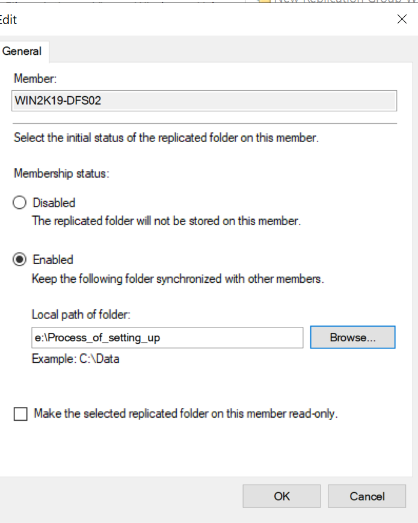

# Installing and configuring DFS replication server

In this step I will be installing and configuring a DFS repllication server

The FTP server will be named WIN2K19-DFS02, and its IP address will be 192.168.1.115

## *Basic set up for the new VM*

Setting up the new VM and testing its connection to WIN2K19-DFS01, which we set up in this [step](../step_14/README.md "WIN2K19-DFS01 set up")

1.	Create and configure a server with the name of WIN2K19-DFS02, static IP of 192.168.1.115, and join it to the domain
2.	Add the DFS replication and server roles to the server like we did on the [first DFS server](../step_14/README.md "WIN2K19-DFS01 set up")
3.	Verify that the new DFS02 server can connect to the 1st DFS server shared resources by going to the shared path \\WIN2K19-DFS01\Setup

    > \\WIN2K19-DFS01\Setup

    - 
    - Yes, it can

## *Set up replication group and path*

Set up the replication group for WIN2K19-DFS01 and WIN2K19-DFS02, and set up replication path

1. Open up DFS Management in the DFS01 server and under the Replication directory, right click on it and select New Replication Group
2. This will be a Multipurpose replication group
3. Name of replication group will be public information
    - 
4. Add the two DFS servers into the replication group members
    - 
5.	Full Mesh to have full communication between the two servers
6.	Replication continuously using full bandwidth
    - This is just because it is a small network, and I am not going to be able to keep the server running all the time to experience scheduled replication, so I am using replication continuously
    - Full bandwidth because I want to get it done faster
7.	Primary member will be WIN2K19-DFS01
8.	The folder on the primary member that will be replicating to the other members of the group will be the same Setup folder as before
    - 
    - Giving it default permissions
9. The path of the replicated folder, the folder that the DFS is replicating to will be on the E drive of the DFS02 server, and it will be named Process_of_setting_up
    - 
    - 
    - 
10.	Confirm the settings are correct and create it
11.	In DSF02 server, the Public Information replication shows up under the replication directory of the DFS management
    - 
12.	The E drive Process_of_setting_up directory is already populated with the data in the original directory of the DFS01 server
    - 

## *Test synchronization between the two DFS servers*

Create file on WIN2K19-DFS02 and see if WIN2K19-DFS01 can see it and edit it.

1. Created a test.txt file in the original directory in DFS01 and it syncs directly with the replication in DFS02
    - 
    - 
2. Used a client machine to map to the \\YCFOREST.LOCAL\Client namespace  
    > \\YCFOREST.LOCAL\Client

    - 
3. Created a test.txt in the drive and see if it syncs with the DFS01 and DFS02
    - 
    - 
    - 
4. It seemed like both DFS01 and DFS02 were able to receive the file that was created using the client machine
5. Which means the synchronization between the two DFS servers are functioning properly

## **DFS replication is now configured and functioning properly**