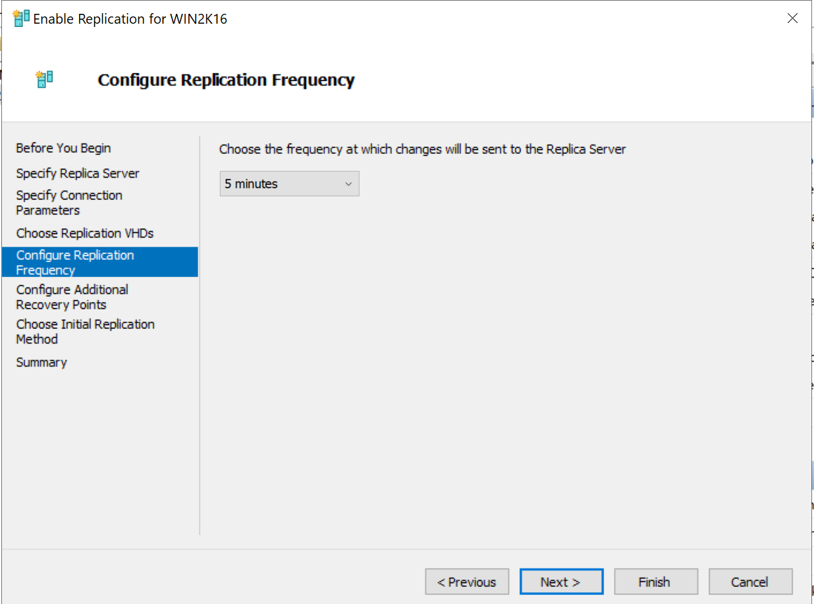

# Installing and configuring Windows Server 2019 Hyper-V replication

In this step I will be installing and configuring a second Hyper-V server and set up Hyper-V replication with [WIN2K19-HPV01](../step_16/README.md)

Second Hyper-V server is name WIN2K19-HPV02 and the IP address is 192.168.1.117

## *Basic set up for the new VM and start configuring Hyper-V replication*

Setting up WIN2K19-HPV02 and configuring Hyper-V replication on both HPV01 and HPV02

1.	Install Windows Server 2019 and do all the necessary configurations
    - Name is WIN2K19-HPV02
    - IP address is 192.168.1.117
    - Moved it to the Servers OU under the Palm Beach OU
2.	Add Hyper V role on to the HPV02 server and configure the Hyper-V settings so it is identical to the one in HPV01 server
3.	Enable Hyper-V replication in HPV01
    - Open up Hyper-V settings in the Hyper-V manager of the HPV01 server
    - Go to the Replication Configuration section, and enable the server as a replication server
    - 
    - User Kerbobos(Http)
    - Replicate from any authenticated server
    - 
4. Do the same above step on HPV02
    - 
5.	Go back to HPV01, right click on the WIN2K16 Hyper-V VM that we made earlier, and select enable replication
    - The replica server(the server to recreate a replication on) will be HPV02
        - 
    - Use port 80 for the replica port and Http connection and compress the data over the network
        - 
        - Using http for authentication type because I do not have SSL certificate. I understand HTTP is unsafe, but I cannot obtain an SSL certificate at the time
6. The replication frequency will be 5 minutes
    - 
7. Create additional hourly recovery points, coverage provided by additional hourly recovery points will be 10 hours
    - 
8. Create initial copy over the network and start replicate immediately
    - 
9. Verify the settings and hit finish to start the replication
10. After the replication is successful, we will see the same VM in HPV02 server
    - 
        - Original VM in HPV01
    - 
        - Replica VM in HPV02
6. After the replication is completed, check the health of the replication
    - Go back to HPV01 server and go to Hyper-V Manager
    - Right click on the VM that we just made a replica of(WIN2K16) and select Replication Health Check
    - It will then check for any issues that may be happening and tells you the health status of the VM replication
    - 
        - Looks like the VM replication is healthy

## *Testing Failover*

Testing planned and unplanned failover with this Hyper-V replication set up

1.	We will attempt a planned failover on this WIN2K16 VM
    - This is a failover that I am doing on purpose, thus planned, if it is actually something crazy wrong happened, it will be unplanned
    - When we have to do an unplanned failover, this will mean that the primary is down unexpectedly and we cannot restore it in time
    - This will mean that we will have to go to the secondary Hyper-V server(HPV02 in this instance), and start the failover from there
2. Steps for unplanned failover
    - Go to Hyper-V manager of HPV02 and right click on the WIN2K16 server, the server we want to do a failover with
    - Select failover from the replication drop down
    - This menu will pop up
        - 
    - This means that the HPV02 server cannot sync the latest data with the primary server, thus, it will fetch the latest backup image of the WIN2K19 VM, and use that to start the WIN2K16 VM on the secondary
    - Once we selected failover, the WIN2K16 VM will run on the secondary HPV(HPV02) server using the latest recovery point image
        - 
3. Back to doing a planned failover
4. Turn the VM off, and right click on it, go to replication and then planned failover
5. Check the start the replica after the failover option
    - 
6. It will then automatically start syncing one last time and start the VM on HPV02, the replica server
7. The one in HPV01 is off
    - 
        - Original VM in HPV01 is powered off
8.	The one in HPV02 is on
    - 
        - Replica VM in HPV02 is powered on
9. The one in HPV02 is also able to access the internet and contact the primary domain controller
    - 
    - Replica VM in HPV02 is able to access the internet and the [Primary domain conroller](../step_2/README.md "Primary domain controller")
10.	The Hyper-V VM at HPV02 reveals a warning that we need to start replication on the VM
    - 
    - This is fine because the original is off in HPV01
    - When you are done with everything and rebooted the primary server, just cancel failover on both the HPV01 and HPV02 machine and resume replication on both of the machines
        - This way everything will be back normally, where the main machine is HPV01 and it is constantly replicating to HPV02 every 5 minutes(just like how we set it up).
11.	The Hyper-V relication and failover are configured

## **Hyper-V replication between both Hyper-V servers are configured successfully and are functioning properly**