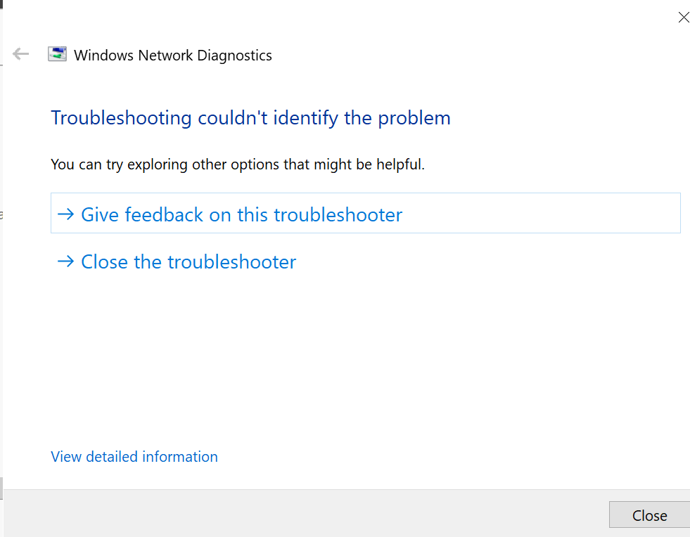
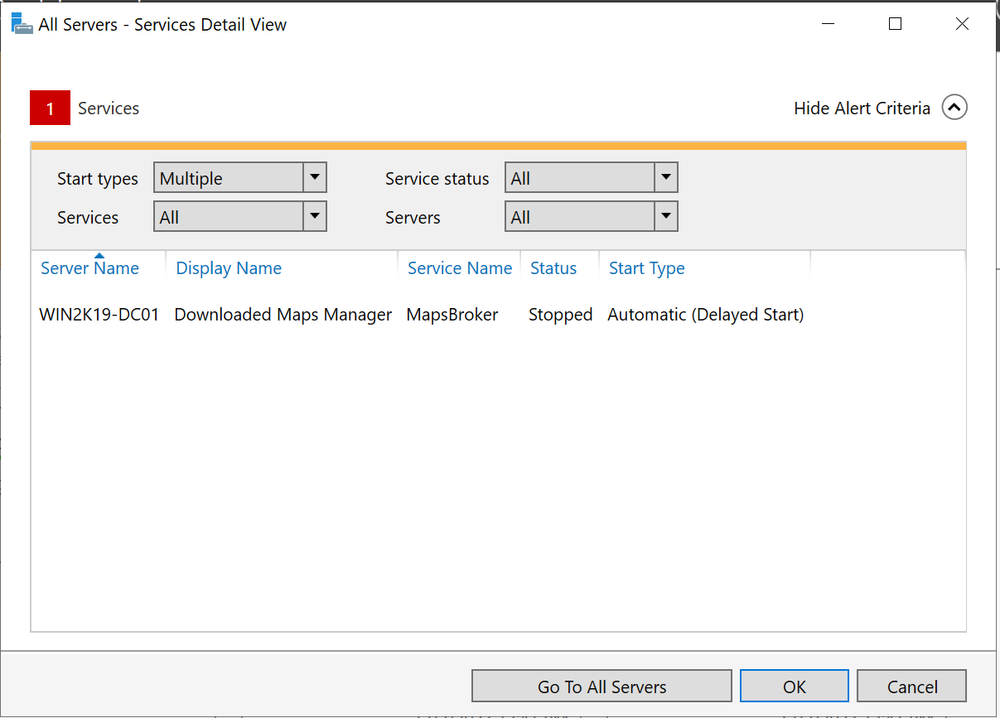

# Configuring my first server and installing the AD domain

In this step I will be configuring the server that I installed earlier and install active directory service on it

## *Change some VM settings in the server so it works better*

1. Changed the VM internet connection from NAT to bridged
    - 
    - Change this setting because I want to set a static IP address in my router, and I am also 
    - Change this setting because I want to set a static IP address in my router, and I am also able to manage the server network better this way as well, since bridged connections allows it to connect to the router directly.
2. Give it a static IP address and DNS server
    - This way, the IP address will not be changed to whatever random address, and this is crucial for a domain controller, as everyone needs to consistently connect to it
    - 
    - Reserved the IP address for my server, manually configured the IPv4 properties and DNS servers
    - 
    - Ran a network diagnostic and it showed not issues

## *Resolve some errors shown in the server manager*

#### Issue encountered: Looks like the Download Maps Manager has been stopped on this server, so I am going to find it in Services and disable it. 

I can start it, but for right now, I do not need this service anyways. 

Attempt to fix: 

1.	Found the service in Services via Server Manager

2. Disabled the service

3. 

4. Go back to the events in Server manager

#### The event has been resolved and cleared

## *Install Roles and Features to this server*
1.	Used Add Roles and Features from the Managed section of Server Manager
2.	The Add Roles and Features Wizard will show up
3.	Select Active Directory Domain Services in Installation type, and select the server name of this server(this is the only server anyways) in Server Selection
4.	Leave everything as it is, and the installation will begin
5.	This step installs the role, we will promote this server into a Domain Controller in the next step
6. 

## Promote this server into a domain controller

1.After the installation is complete, there will be an option that allows you to promote this server to a domain controller 
2. 
3. The Active Directory Domain Services Configuration Wizard will appear
4. I will select Add a new forest, since that is what I am doing(starting from scratch)
5. Give the root domain a name
    - I put the domain name as "YCFOREST.local"
    - 
6. The Domain Controller Options will be next 
- I put Forest level at Windows Server 2012 just in case that I might be getting another older version of the server on the forest, so I chose 2012 just to give myself more options on being backwards compatible

- This is a DNS server and a Global Catalog Server

- I have set a Directory Services Restore Mode server so I can restore AD in the future if needed, and I am not telling you the Password

7. I left all of the rest of the setting as default, and once I got to the review section, I got a PowerShell script for the installation. I saved the script to somewhere safe so I can review it later on
    - 
    - The computer will reboot during the installation and promotion process
    - It is taking its sweet time, so I am just chilling before I go to the next step

## Finish adding the AD domain services role and check to see if it worked
1. After the installation and promotion is complete, this is what I get for the login screen
2. 
3. Ran the set command and saw that I am currently logged in to my YCFOREST domain
    - 
4. Ran the netdom query fsmo command in cmd to show the 5 flexible single master operations role that are running in the server
> netdom query fsmo

## Issues to fix: I have no internet right now
1.	After the installation is complete, the server lost internet connection even though that it has ethernet connection
2.	I am suspecting that it is because after installation process, the network settings, such as DNS and IP configurations, has been messed around a little bit.
3. 
4.	Went to troubleshoot by going to the network settings in control panel and opened up the network properties
5. 
6. Yup, my DNS server address is now gone
7. To fix, I went to the IPv4 Properties, and found that the primary DNS became the loopback address
8. 
9. I will change it to 192.168.1.105 for the preferred DNS server, for alternate DNS server, it will be 8.8.8.8
10.	After I have inputed those values, it asked me to do a restart, and the internet came back after the restart
11. 

## Create some organizational units in Active Directory

Now that this server is a functioning domain controller, I am just going to create some Organizational Units in my Active Directory, so in the future, I can have more of an organized things to refer to

1. Created an OU call PalmBeach in the domain, and within that OU, I made 4 OUs called Computers, Users, Groups, and Servers
2. 
3. I also renamed the name of my site Default-First-Site-Name to PalmBeach in Active Directory Sites and Services
    - 
    -  
    - The site name for my server in Active Directory Users and Computers has also been changed in after I changed the site name.

## Make a group policy

Create, deploy, and test a group policy that will allow for inbound and outbound connections in all server firewalls

1. I opened up Group Policy Management
2. Created a GPO in my newly established domain
    - This will be a firewall group policy that I want to set for the domain
    - 
    - I will turn the firewall off and allow inbound and outbound connections
    - 
    - The path I took to get there
        - 
3. For the inbound rules, I will allow connections from Active Directory Domain Services, File and Print Sharing, and Windows Management Instrumentation(WMI)
    - 
    - What it looks like after the inbound rules has been populated ^ 
4. For outbound rules, I will allow connections to Active Directory Domain Services, File and Print Sharing, and Windows Management Instrumentation(WMI) using the Predefined Rules
    - 
    - What it looks like after the outbound rules are populated ^
5. One last policy to add would be to customize the ICMP PING inbound for my domain, for that, I will create a new Custom rule
    1.	It will be for all programs
    2.	The Protocol type would be ICMPv4
    3.	It will be for any remote and local Ips
    4.	Allow the connection
    5.	Only allow it for the domain
    6.	Name it PING
    7.	This will allow me to make check that this server is reachable in the future once the I populate the domain
    8. 
    9. ^ What it looks like after configuring the ICMP PING custom inbound rules
6. Use gpupdate /force and gpresult /r to update and see the result of the policy update
    > gpupdate /force 

    > gpresult /r 
    > 

    - gpuodate /force is to update the group policy in the computer
    - gpresult /r is to see if the policy shows up in the computer
    - 
    - The policy is updating and it shows a successful update
    - 
    - It looks like my new Firewall policy has been updated successfully