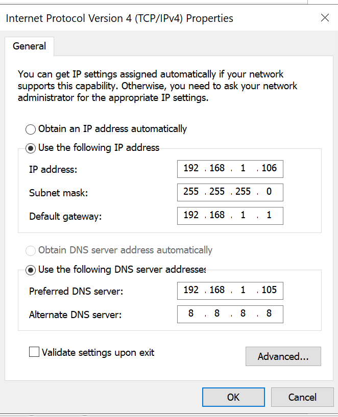
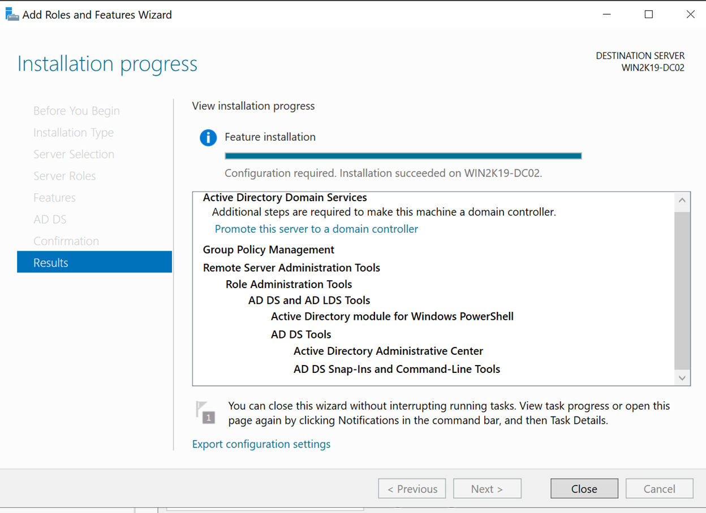

# Installing and setting up secondary domain controller

In this step I will be Installing and setting up secondary domain controller(WIN2K19-DC02), and creating a user with the secondary domain controller as well

## *Installing and configuring VM*

1.	Just went ahead and did a clean installation of the Windows Server 2019 on another VM
2.	I went ahead and lowered the RAM on both my Primary and my Secondary Domain Controller to 2GB because my computer just is does not have that much RAM right now
3.	Set up the IP static IP address for the secondary by using Bridge connection to connect it to my router, and from the router I assigned the static IP address(192.168.1.106) for the new VM.
4.	Set up the network configuration by allowing the doing the giving it the static IP address and set up the primary VM IP address for the DNS server, since the first VM(WIN2K19-DC01) is also configured as a DNS server
5.	I also have renamed the second VM to WIN2K19-DC02.
6. 
7. Set up static IP address
8. 
9.	It is now all set up for network

## *Add Active Directory Service role to the server*

I will be adding Active Directory Service role to the server then promote and configure this as a domain controller

1.	Use the Add Roles and Features Wizard from the Server Manager to do this
2.	It will be Role-based installation
3.	Select this server when it is asking which server to do it on
4.	Select Active Directory Domain Services for server roles
5.	Leave the rest as it is and let the installation begin
6. 
7.	After this is done, click the Promote This Server to a Domain Controller option that was presented to us
8. 
9. This time, we will select Add a domain controller to an existing domain option
10. Provide my domain controller name to the domain name field and give it the admin credentials for this new server
    - The name will be WIN2K19-DC02
11. Problem encountered:
    - When I try to give the Wizard credentials to add this VM as a domain controller of my YCFOREST domain, it kept on telling me that my user name and password are incorrect
    - I thought that it could be the fact that this is server is not a part of the YCFOREST domain, so the YCFOREST main domain controller does not recognize the credentials that I gave it
    - I added this server to the YCFOREST domain in the Server Manager
    - 
    - Now it can be connected to the YCFOREST domain in the Active Directory Domain Services Configuration Wizard and I can move on to the next step
12. I will be configuring this as a DNS server and a Global Catalog server
    - GC server is a feature that AD has that allows the server to provide information on any object of the forest, regardless of whether or not the object is a part of the domain or not.
13. The Site that it will be configured to will be call PalmBeach, since that is my only site right now
14.	Set up the Directory Restore Mode Mode password for when my AD crashes, and **I am not going to tell the password**
    - 
15.	Replicate from any domain controllers, even though we only have one right now
16.	Leave the AD paths as defaults
17.	Save the PowerShell script to somewhere safe in case I want to do something with this later
18.	Installing after it has past the prerequisite checks, and now I am just waiting for it to be finished
19. 
20.	It is done now and the second DC is now showing up as a domain controller in the YCFOREST AD
21. 
22.	Just to verify again with netdom query dc command to see if WIN2K19-DC02 is a domain controller right now
> netdom query dc

23. 

24. Now it is time for me to create some users in my domain

## *Creating users in my domain*
1.	In my AD users and computers PalmBeach site, I have already created 4 OUs: computers, users, servers, and groups
2.	I will be creating a new user in users OU
    - 
        - Users OU in PalmBeach OU now
    - I have created a user called User1 in my second domain controllerand I am not gonna tell you what it is
        - Did that by right clicking on the Users OU within the PalmBeach OU, and selected new --> Users
        - Give it the name User1 and its login credentials
        - 

**The secondary domain controller is now up and running**