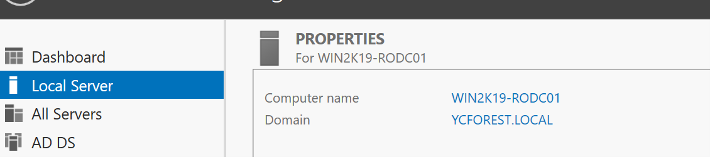
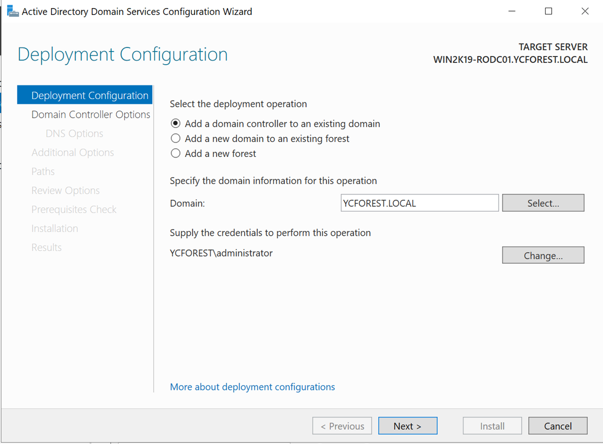
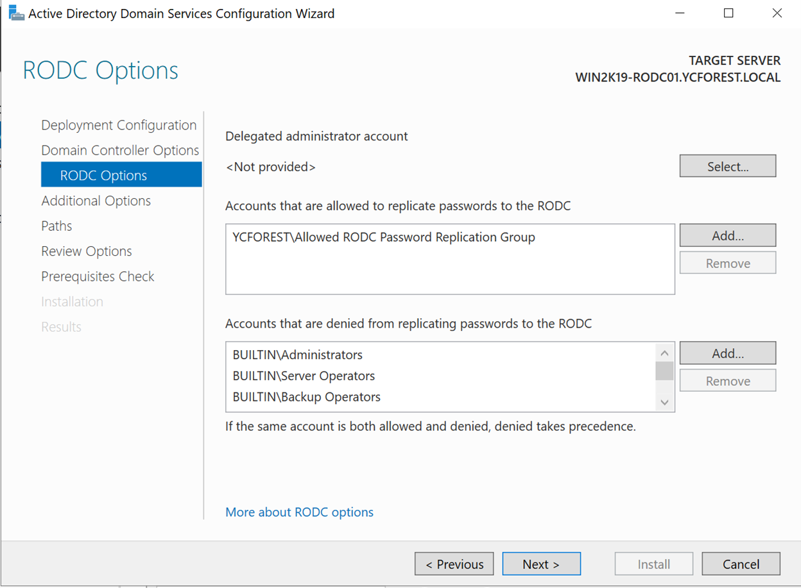
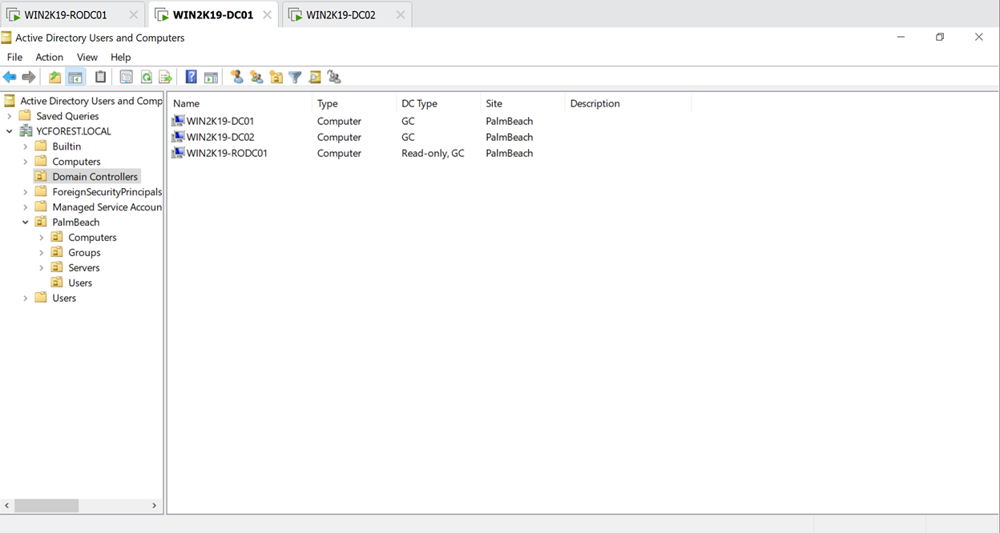
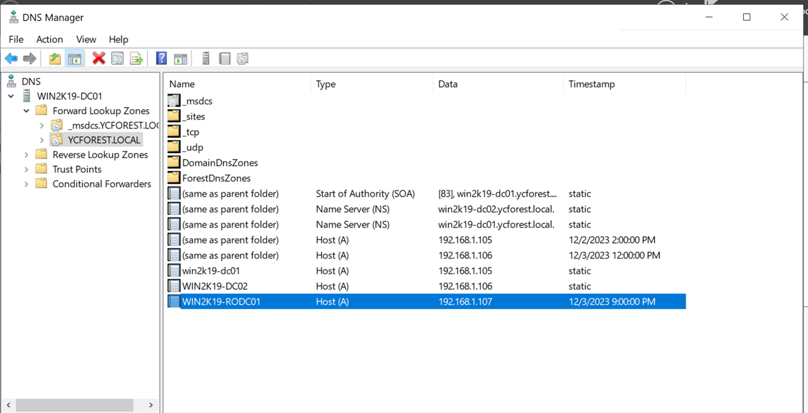
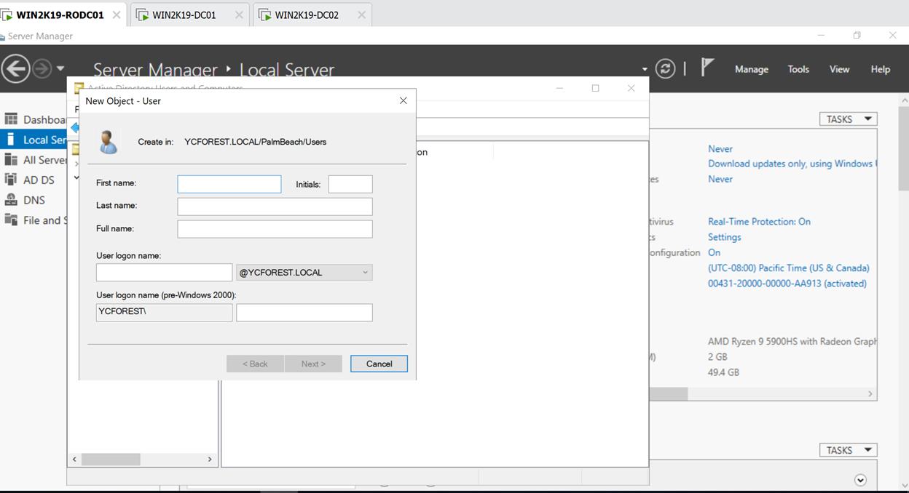
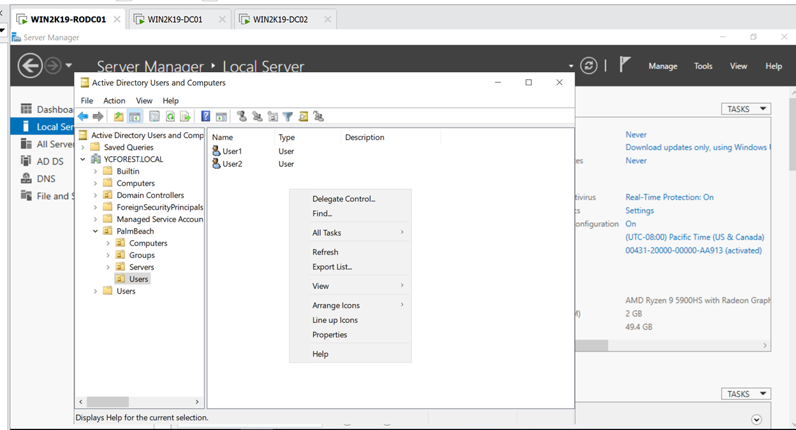
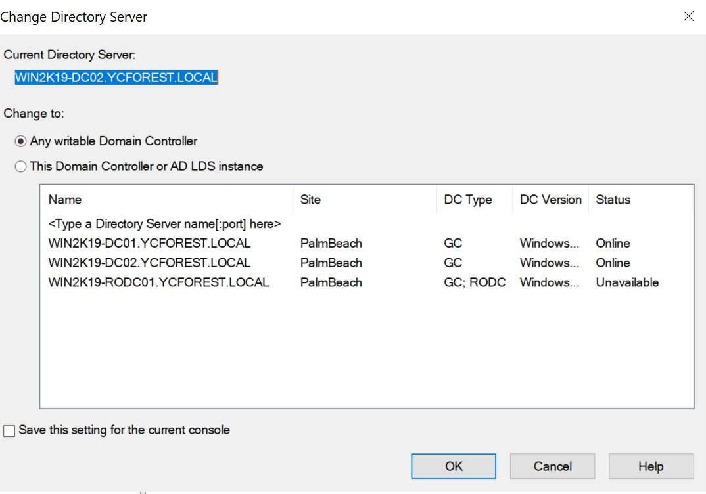
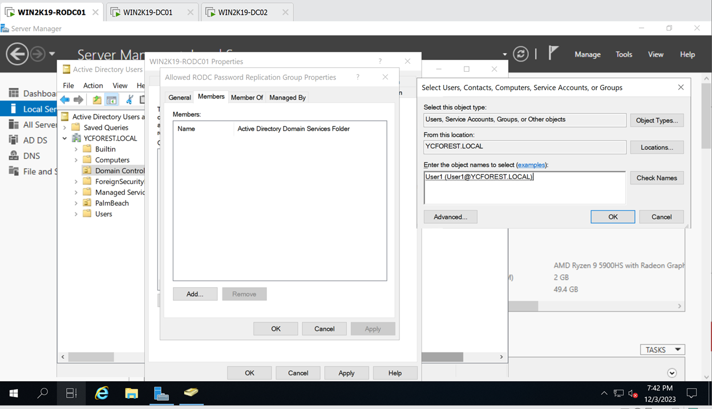
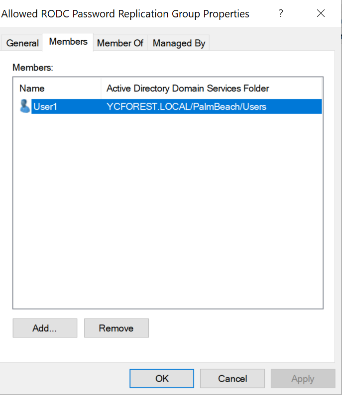

# Installing and Configuring Read only domain controller

In this step I will be installing and configuring my read only domain controller(WIN2K19-RODC01)

## *Complete basic installation and configuration on the new VM*

1.	Installed a new Windows Server VM and did the same configuration as the other 2 Windows Servers
2.	Configured the IP address as 192.168.1.107, and changed the name to WIN2K19-RODC01
3.	Have both of my previously set up domain controllers open

## *Promote this VM to be a domain controller*

1. Use Add Roles and Services Wizard
    -	It will be role based
    -	Select this server
    -	Add Active Directory Domain Services
    -	Leave the rest as it is and install
2.	After the roles have been installed, now it is time to join this server to the YCFOREST domain
    1. First, we need to join this server to the YCFOREST domain
    2.	It will restart, after the restart, the server will now be a part of the YCFOREST domain, and then we can go ahead and promote this server as a read only domain controller
    3. 
    4. IT is now part of the domain
3. Use the server manager notification of open up the Active Directory Domain Services Configuration Wizard 
4. Provide the Active Directory Domain Services Configuration Wizard with the admin credentials from the YCFOREST domain
    - 
5. This will be 
    - A global catalog server
    - Read only domain controller
    - DNS server
6.	Give it a Directory Restore Mode Password
7.	Site will be Palm Beach
8.	Leave the groups that can have their passwords replicated as default, and leave the groups that can’t be replicated the same way
    - We have not added any users for that group just yet since we do not have enough users in this domain just yet
    - 
    - But for the ones that can’t have their password replicated, it should be normal, since these are users with a lot of privilege
9.	It will replicate from any Domain controllers, since we have two
    - It can be subjected to change later on as our forest grows
10. Save the script to a secret location, and leave the rest as default
11.	Begin the installation after the server has passed the prerequisite check
    - It will take its sweet time
12.	The server finished the role promotion, now it is showing in Active Directory as a Domain Controller, but with Read only in the Domain Controller type, which is what we wanted
    - 
13. It is also showing up as a DNS server in the DNS Manager, which is what we wanted
    - This is because all of our Domain Controllers are all DNS servers
    - 

## *Test to see if the server is truly read only*
1.	Went ahead and try to see if I can create a new object with the new Read Only Server
2.	I can for some reason, and I do not want that
    - 
    - Selected Windows Server2019 Datacenter Evaluation (Desktop Experience)
3. After going on Google, I found that I need to change to the current Read Only Domain Controller order to make this truly read only
4.	I head over to the Active Directory Users and Computers and right click on the top of my current domain
5.	Select Change Domain Controller…
6.	Select the Read Only Domain Controller that we have created
7.	Now I cannot even see the new option
8. 
9. I can always give myself the ability to write with the RODC by changing the Domain Controller

## *Add user to the allowed RODC Password Replication Group*
1. I will give myself the ability to write with the RODC and add a user to the allowed RODC Password Replication Group
2. I will need to change the domain controller to any writeable domain controller, or else the add options will be grayed out
3. 
4. It is only the RODC that has the password replication option, the other two domain controller does not
5. Go to the domain controller OU and double click on the RODC, and now select the password replication policy tab
    - Select the Allowed RODC Password Replication
    - Click add
    - Select the members tab
    - I will add user1 to the group by searching for that user after clicking the add button
    -
6.  Click ok and apply, and the user is now added to the allowed RODC password replication group
    - 
    - Remember to change the domain controller back to the RODC so it becomes a read only domain controller again once you are done

**The RODC is now fully set up and ready to go**
