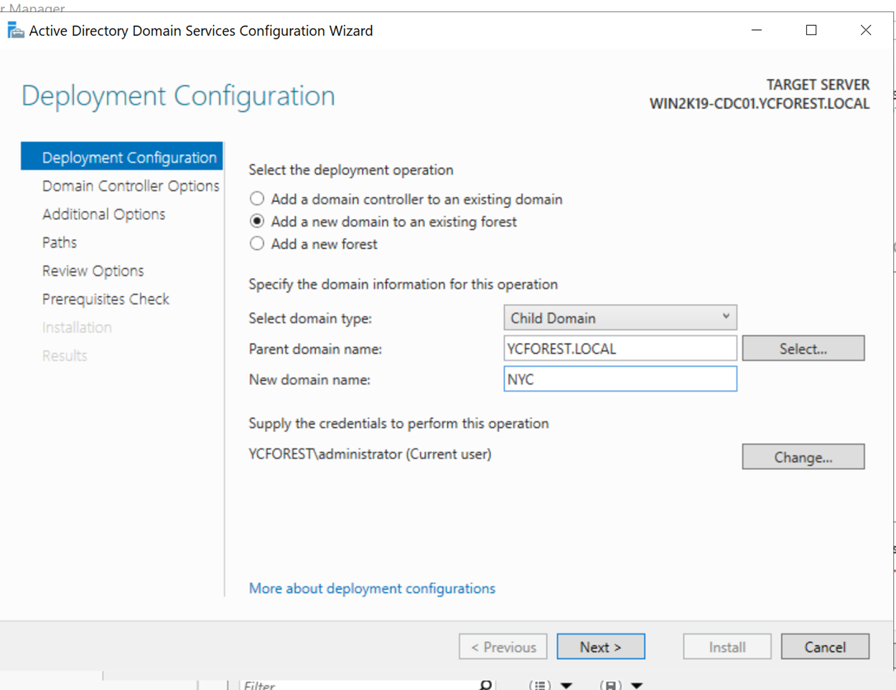

# Installing Child Domain Controller

In this step I will be creating a child domain in the YCFOREST forest and configure a child domain controller(WIN2K19-CDC01) to oversee that child domain

## *Basic installation and set up for the VM*

1.	Made a clone of a freshly installed Windows Server 2019 VM in VMware
2.	Used the Sysprep to generalize the newly set up VM so it can have a new security identifier(SID).
    - Before, the SID will be the same as the VM that is was cloned with, and without using Sysprep to generalize the machine, it will cause some issues with our domain later when we try to build our structure
3. Did the basic network configurations and renamed it to be WIN2K19-CDC01, the same process I use for every server
4.	Join the WIN2K19-CDC01 to the YCFOREST.LOCAL domain, but don’t install AD services just yet
5.	Login in as a local admin on WIN2KCDC-CDC01

## *Add Active Directory Domain Services role to this server and promote it to a domain controller*

Create a VM and promote it to be a child domain controller

1. Use Add Roles and Services Wizard
    -	It will be role based
    -	Select this server
    -	Add Active Directory Domain Services
    -	Leave the rest as it is and install
2.	Promote the server to a domain controller, but this time, it will be adding a new domain to an existing forest
    - Give it a new domain name of NYC
    - 
    - Leave everything as default for the Domain Controller options list and give it an DSRM password
    - 
    - NetBIOS domain name will be NYC by default
    - Install after the setting the paths(I left it as default) and prerequisite check is done
    - After the installation is done, the restart is finished, it will show up in the AD as a server
    -This is now a Child domain controller controlling the child domain NYC replicating from and to DC01 and DC02
    - 
3.	Since this is a child domain, it is essentially a separate domain in our forest, therefore, the Ous that we created and the two domain controller for YCFOREST.LOCAL is not showing up in the AD for NYC.YCFOREST.LOCAL.

## *Join a client machine to the child domain*

Make a client machine and join it to the child domain

1.	Creating a Windows 10 client called WIN-Client and let it be a part of the NYC child domain
    - Configure the IPv4 address for the client
    - Leave it as DHCP, and use the Child Domain Controller IP address for the primary DNS server
2.	Configure The AD in NYC.YCFOREST.LOCAL in the child domain controller, and create a New York OU and Users OU within that New York OU
    - Create a user called User1 in that Users OU that we have created
    - User1 should not have any permission to access the system settings since we never gave it any admin permissions, so when it prompts, we will use the default administrator account for the NYC domain to login
3.	Join the client to the NYC.YCFOREST.LOCAL 
4.	Login using the Users1 account in the client to the NYC domain and after it has joined the domain
5. 
    - Added the domain as nyc.ycforest.local
    - Changed the computer name to WIN-Client
6. And we will see that in the DNS record for the NYC domain, the client shows up since we added the IP address of the Child Domain Controller for NYC domain as DNS server for our client
    - 
7. After running the set command in the client, it confirms that our DNS domain is the WIN2K19-CDC01 child domain controller and it is under the NYC child domain
    - 
    - The set command shows that the client domain is NYC.YCFOREST.LOCAL

**The Child Domain Controller is now fully set up and ready to go**
