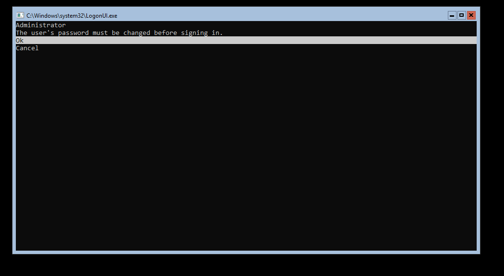
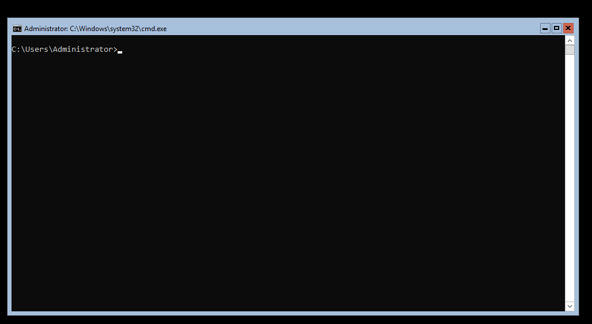
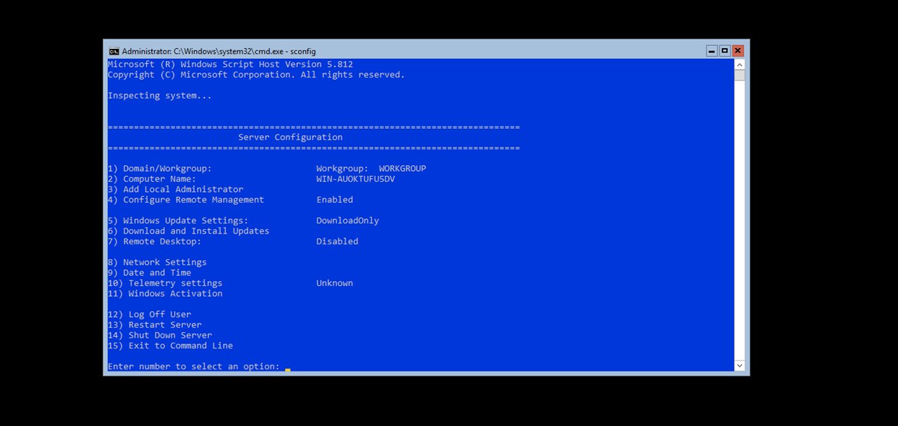
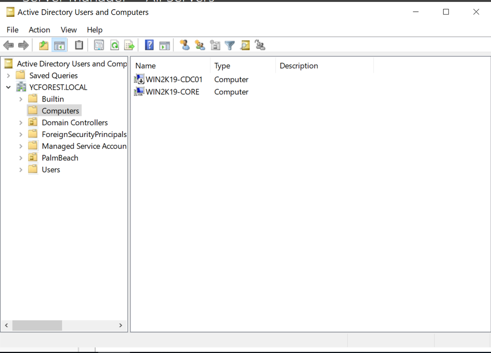
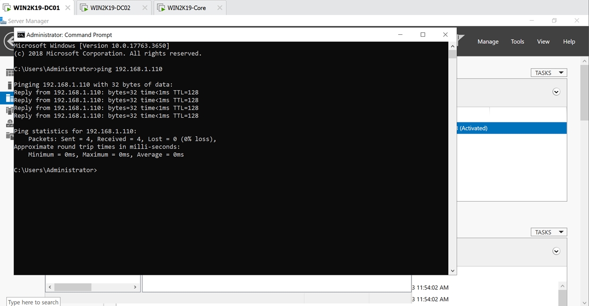
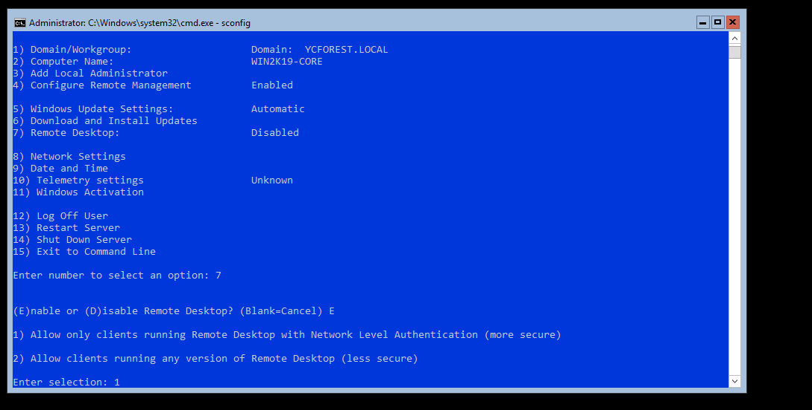
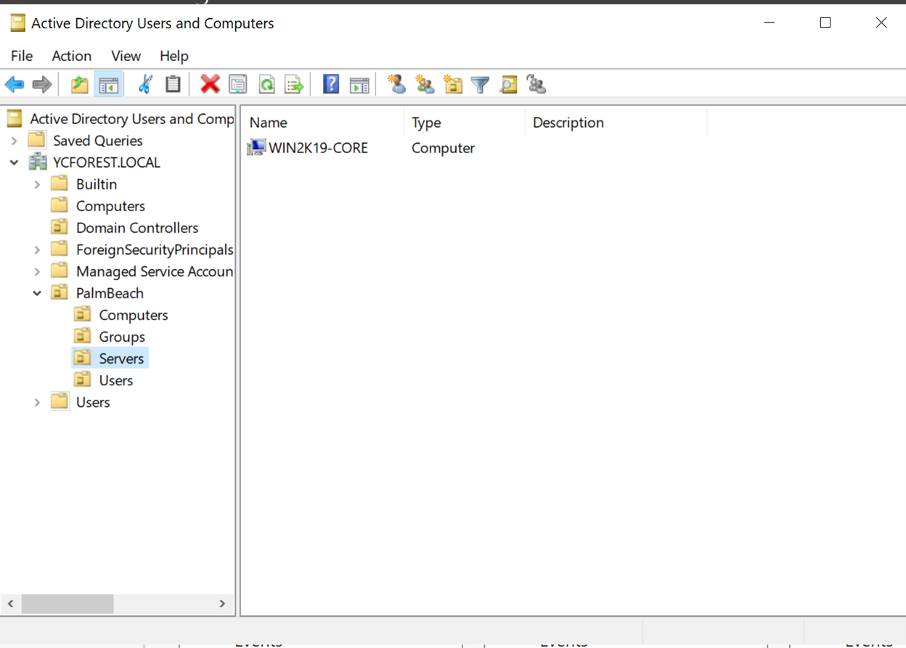

# Install Windows Core Server

In this step I will be installing and configuring my Windows Core Server(WIN2K19-CORE)

## *Install and configure the Windows CORE server*

Install the CORE server into a VM, give it a static IP address, join it to the domain, and do some Active Directory management for this VM

1. Install the server using the Windows Server 2019 Evaluation, instead of Evaluation Desktop experience and name it WIN2K19-Core
2.	Let is do its thing and after that, this is what we get
    - 
3. After setting up the admin password, this is what we get
    - 
4.	Configuring this using the command sconfig
    > sconfig

    - 

5. Changing the IP settings first by inputting 8 in the option
    - First will be by setting up a static IP address by following the options that it gives us
        - Gave it 192.168.1.110 in the router and assigned it to the VM at the network setting
    - Second, we will be setting up the DNS server
        - Primary and secondary domain controller will be the primary and secondary DNS server for this VM
6. Change the domain and computer name of the server
    -	The domain will be YCFOREST.LOCAL
    -	The name will be WIN2K19-Core
    -	It is now showing up in the AD of our YCFOREST domain
    - 
    - We are also able to ping it from our primary domain controller since now it is joined to the domain, the Firewall policy was able to take affect and allow the connection to happen
    - 
7. Sign in using the Admin credentials from the YCFOREST domain
8. Configure remote desktop to allow only customers with Network Level Authentication
    - 
9.	Moved the device from computers OU in AD to Servers OU of the PalmBeach OU I have made in the earlier steps
    - 

10. Installing the Windows Core Server allows for a simpler server that requires less resources to maintain
    - If you just need a server for something simple, you can install a Windows Core Server, it will require little resources to maintain and it will have little attack surface because it has limited features
    - It makes the structure more secure and easier to manage

**The CORE server is set up**