# Installing and Configuring File Server

In this step I will be installing and configuring a file server to my domain(WIN2K19-FS01)

IP address will be 192.168.1.108

## *Complete basic installation and configuration on the new VMs*

1.	Installed and set up a new Windows server and a Windows 10 client
2.	Reserved a new static IP address for the server under a bridged connection and joined it to the YCFOREST.LOCAL domain

## *Add and install roles and features*

1.	Under server roles, instead of adding active directory domains and services, we will select file server
    - File and storage services
        - File and iSCSI Services
            - File Server
    - Leave the rest as default and install after it has past the prerequisite test
    - The file server is now installed and it is time to configure the file server

## *Mount and make a simple volume out of a second drive*
1.	I have added another 20 gig virtual drive into the VM
2.	I got that drive online in disk management and made a simple volume out of it
    - 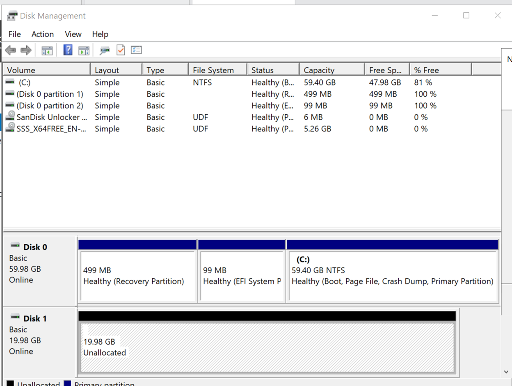
3.	The drive letter will be F, label will be data share, and it will be performing a quick format
4.	This drive is now online and ready to go
5. 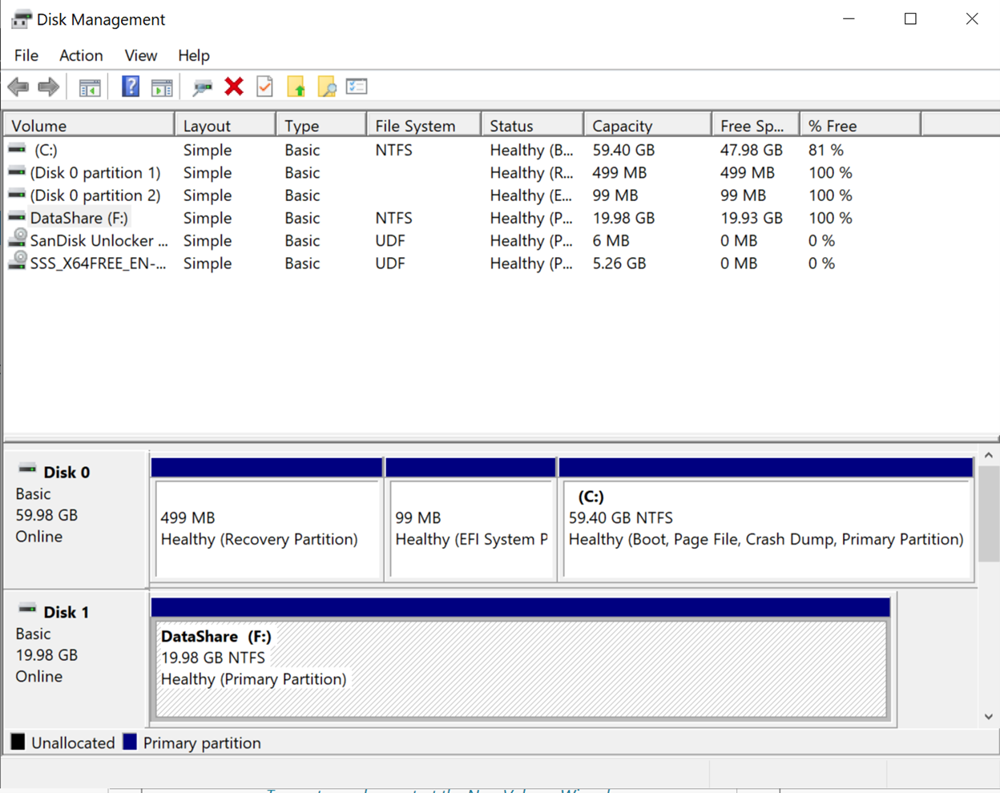
6. 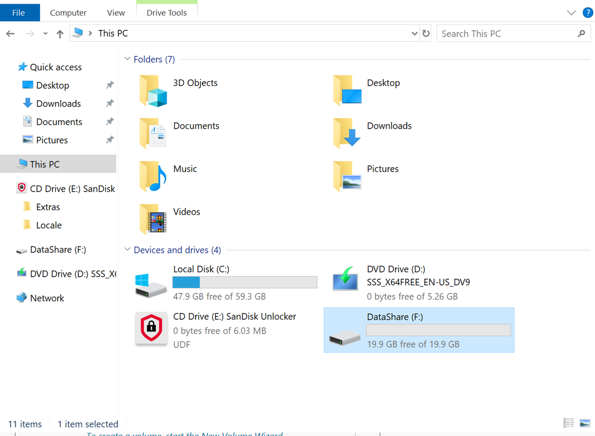

## *Create a new file share with the share wizard*
1. After confirming the new volume is online and available, create a new file share with the share wizard
2. I am gonna do a SMB share quick for the share profile
3. Select the F drive that we just configured
4. Share name will be UserData
    - 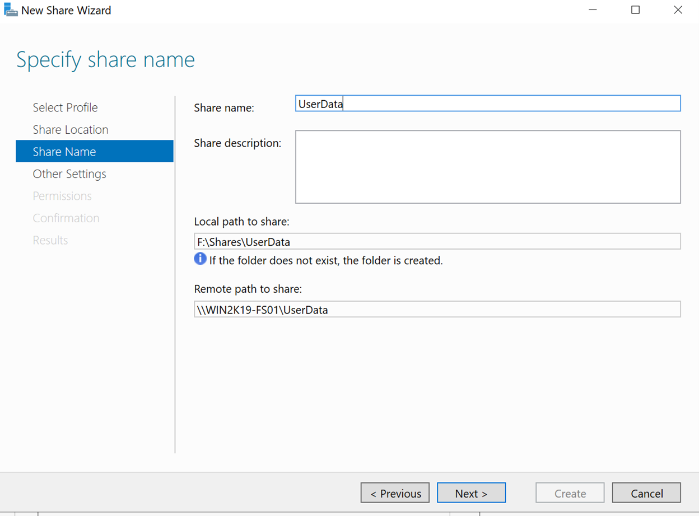
    - The Shares\UserData folder will be created after the share has been configured
5. Enable access-based enumeration and caching of the server
    - It enumeration is important because it will allow the users to see what they are allowed to see and hide what they are not allowed to see.
6. Leave the permissions default at the moment
7. 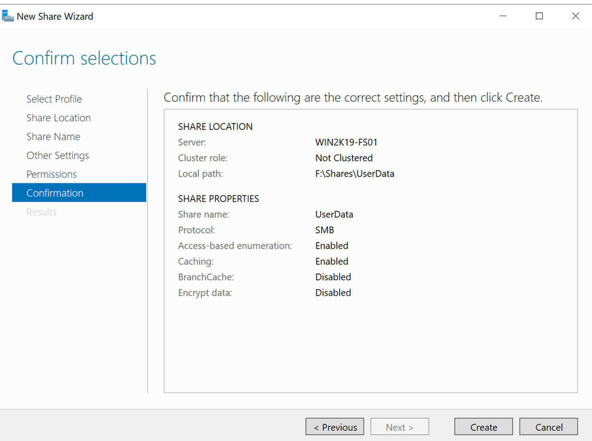
    - Read and confirm the settings
8. Select create and let it do its thing
9. Confirm that the share drive is created
    - Use the command line net share to see if the share name of the share that we created shows up
    > net share

    - 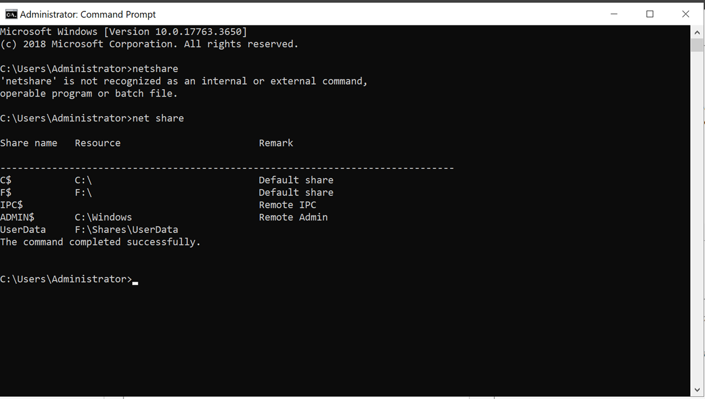
        - It is showing up(at the very bottom)
    - Check the server manager as well
        - 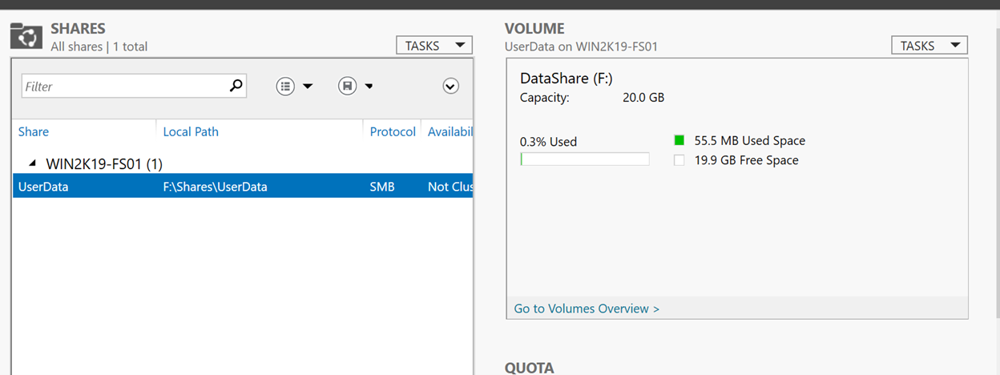

## *Setting up the security permissions for the UserData share*

Create two folders and two users, and assign each user different permissions for the folders

1.	Go to the UserData folder(which is created after the share has been configured) that is within the shares folder of the F drive that we have created and access the properties of the UserData folder
2.	User1 will only be able to have read and write permissions
    - Change the permission by right clicking on the UserData folder, select properties, go to the security tab, select User1 and check read and write permissions
3.	User2 will have modify, read, and write permissions
    - Change the permission by right clicking on the UserData folder, select properties, go to the security tab, select User2 and check, modify, read, and write permissions
4.	Create 2 folders and name them User1 and User2
    - Names of both folders: User1 and User2
    - There are 1 text file in each folder
    - 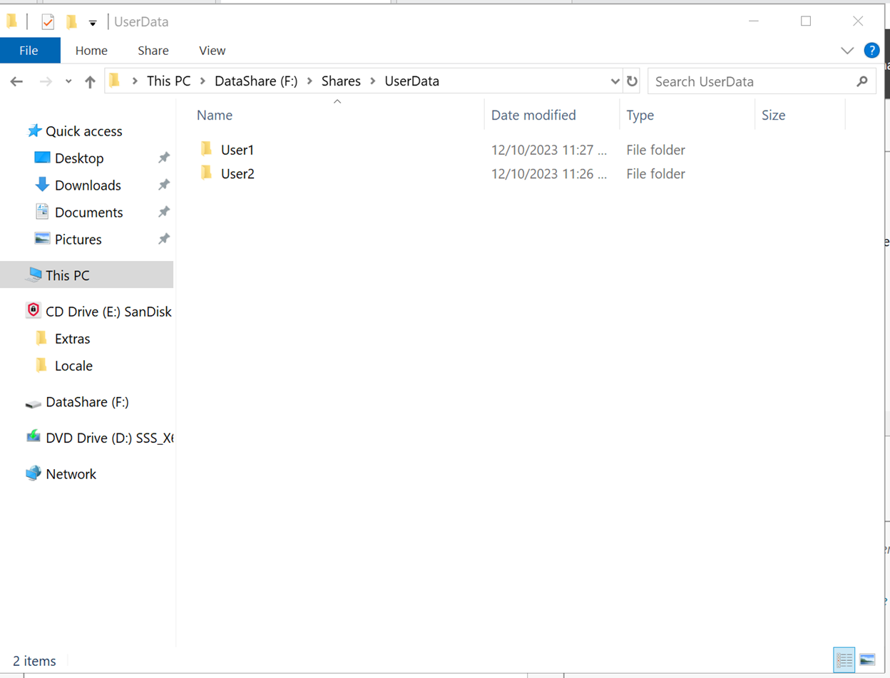
5. Access the share with User1 on a client computer
    - I created a Windows 10 client and joined it to the YCFOREST.LOCAL domain
    - I have access to the file in both folders
    - 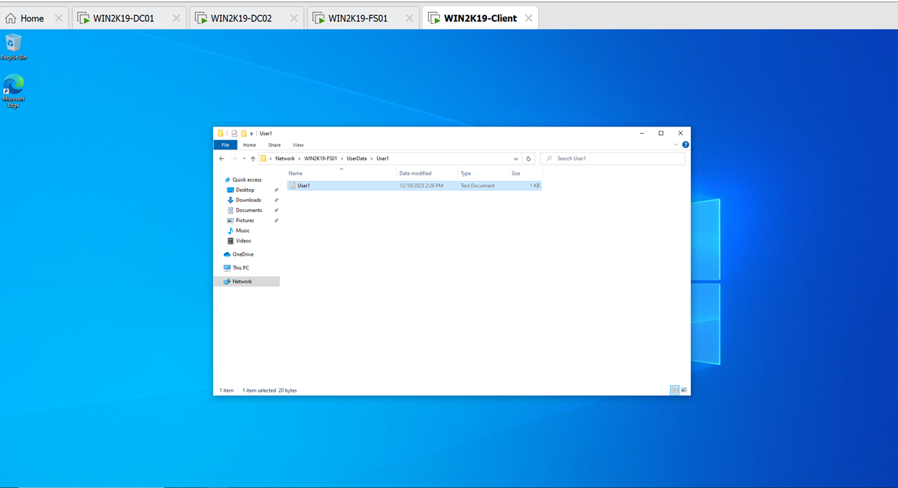
    - 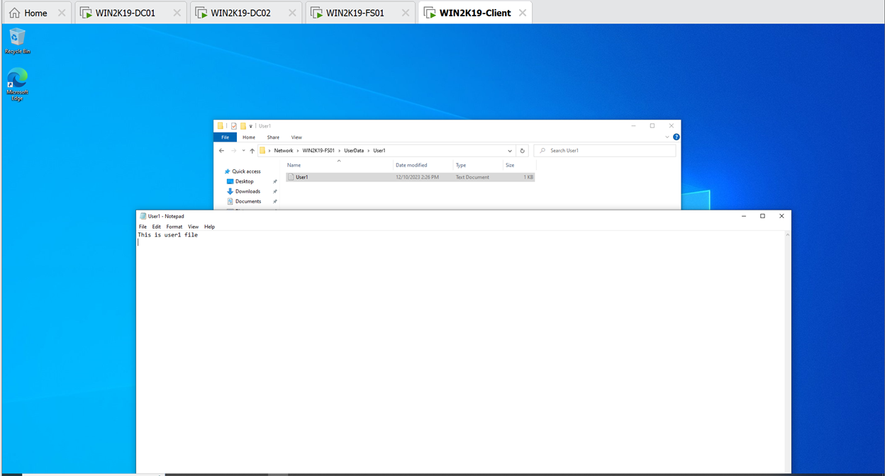
    - However, I do not have the permission to delete the file as User1
    - 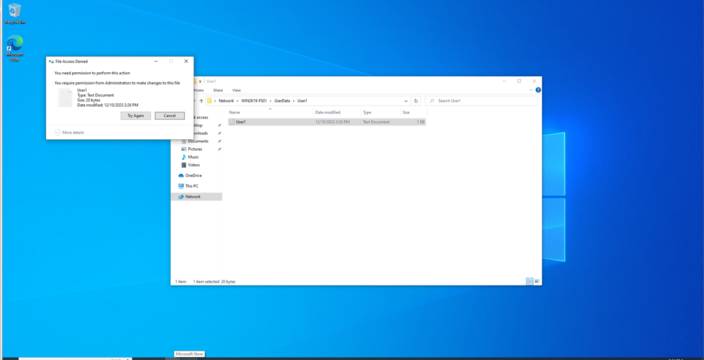
    - This is good because User1 only supposed to have read and write permission
    - User1 can still create file in the shared drive, and delete the file that he has created, since he is the owner of the file that he created and he has write permission(for creating files).
6. Access the share as User2 on another client Windows 10 machine
    - I can now delete any file on the share 
    - I can add and modify files
    - Which is good because we now have modify permissions as User2, which allows us to delete and modify the files on the drive
    - 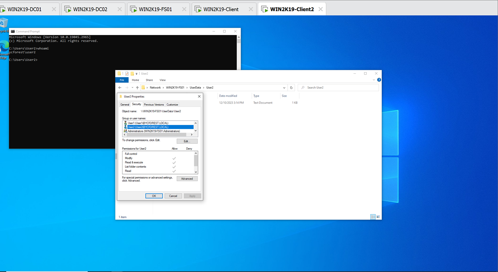

## *Map Drives in client machines*
1.	I want to permanently keep the network drive in my computer connected so I can access it any time
2.	To do this, we need to map the drive to our computer
    - We are doing this for User2
3. Go to File explorer
4. Go right click on This PC and select Map a Network Drive
    - Type in \\WIN2K19-FS01 and then hit browse

    > \\WIN2K19-FS01

    - This is the server name, which is necessary for the path
5. Select User2 folder under the UserData Volume
    - 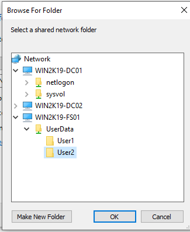
    - This is selecting the folder for User2 client to map to, so when they access the network drive via the mapped drive, it will take them directly to the folder that it is mapped to
6. Click OK and then Finish
7. The Drive is now mapped to our computer
    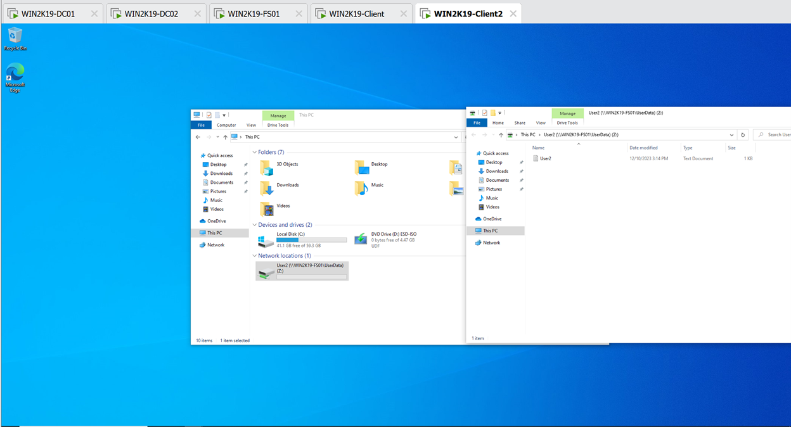

**The file server has been successfully configured and is functioning properly**
