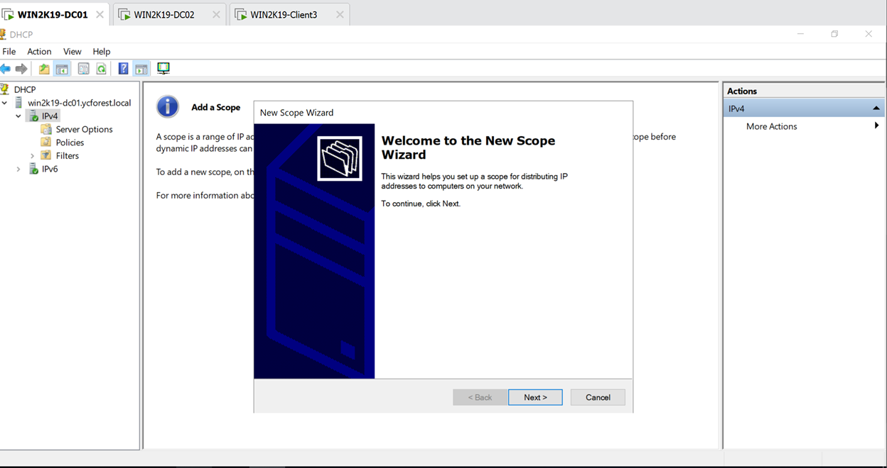
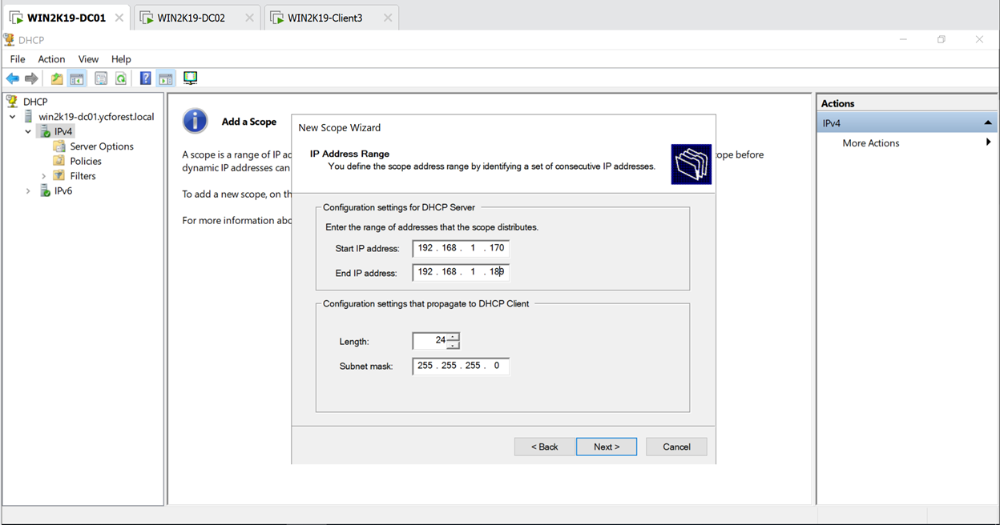
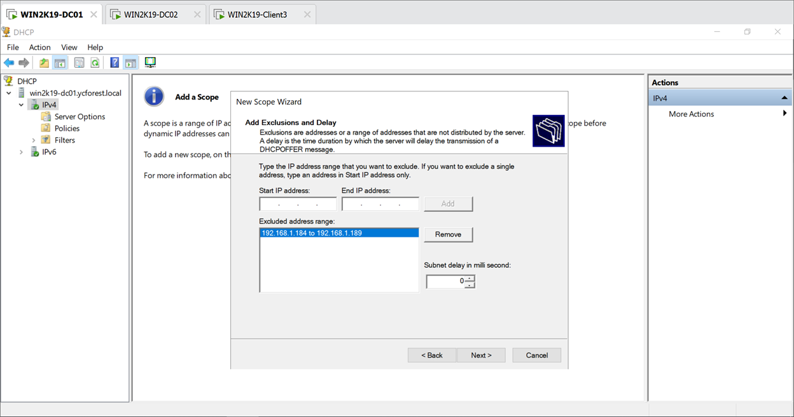
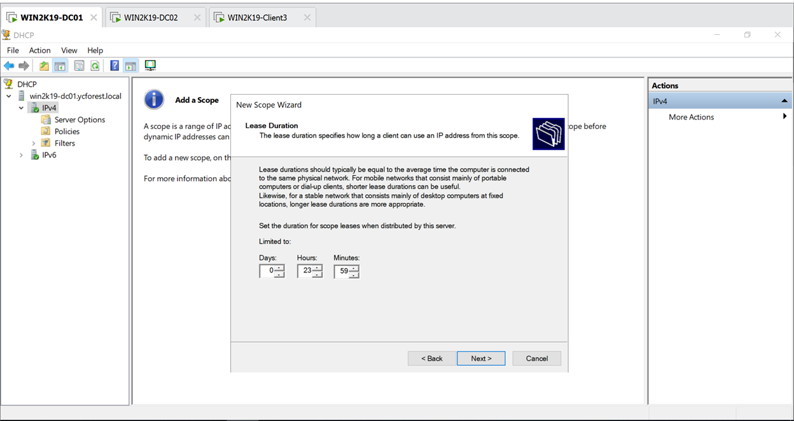
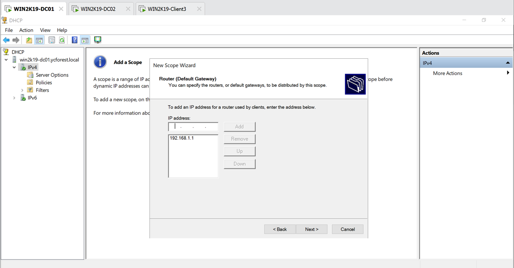
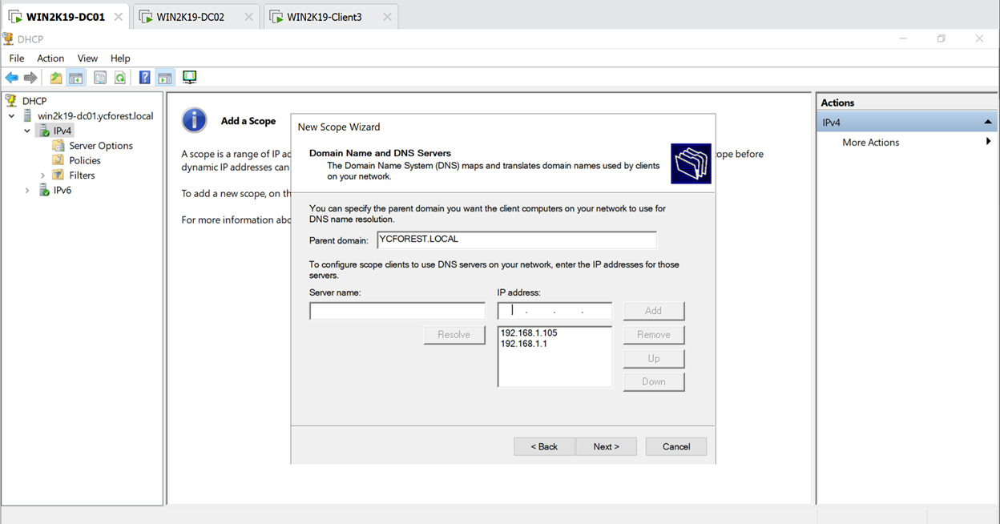
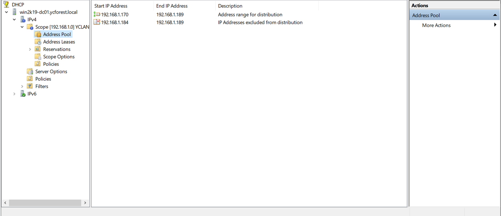
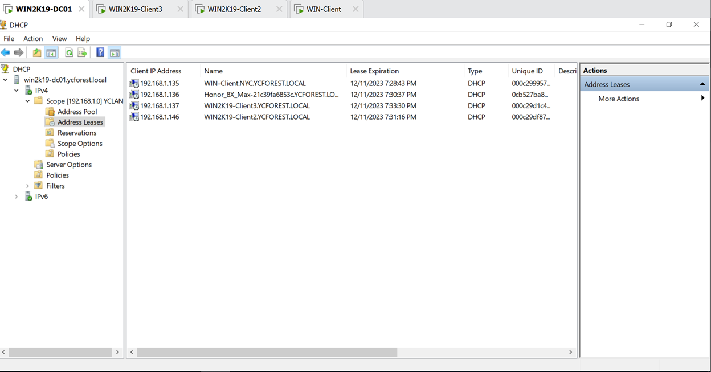

# Installing and Configuring DHCP service

In this step I will be adding DHCP service to the primary domain controller(WIN2K19-DC01)

I understand that putting it on primary domain controller is not a good idea for fault tolerance and overall security(as I found out later), but I am doing it because I want to save the limited space that I have on my drive and save my RAM as well.

Looking back, I think I could have configured DHCP later, and configure it on another member server much later on, but at the time, I was blindsided.

## *Add roles and features in the primary domain controller*

1.	It is a roles based feature 
2.	Select DHCP server tools
3.	Leave the rest as default
4.	Install
5.	Select complete DHCP Configuration via the notification flag or from the window after the installation is completed
6.	Use the default admin credentials for the domain(since that is what I have been using and do not have other admin accounts added)
7.	Leave everything as default and we are done with this step

DHCP has been installed and we will move on to configure the DHCP scope

## *Configure scope for DHCP*
1.	Restart the DHCP server service by going to services under tools in the server manager
2. Select DHCP under tools in the server manager
3.	Right click on IPv4 and select add new scope and the new scope wizard will come out
4. 
    - New scope wizard is used to set up DHCP scope
5. Give it a name and a description
    - Name: YCLAN
    - Description: YC's LAN network
6.	Give it a starting IP and an end IP to define the scope
    - 
    - Gave the range of IP addresses, length and subnet mask
    - My subnet mask is 255.255.255.0, which means that I have a 24 bit subnet, hence the length is 24
7.	Give it a starting IP and an end IP to define the scope of the addresses that are excluded
    - 
8. Set the IP address lease period
    - Lease period: the amount of time that the IP address will be held by a DHCP client
    - 
    - My lease time for this will be 23 hours and 59 minutes, and 59 seconds. Because I want it to change in a day
9.	Configure the DHCP options for the scope now
10.	Give the address of the router that will be used by the clients
    - 
    - This one will be my normal home router, so the IP address for this will be 192.168.1.1
11.	Configure the DNS servers that will be used
    - 
    - I gave it the primary domain controller(192.168.1.105; and all DCs have DNS services in my domain) and the router address(since the router also acts as a DNS server as well)
12.	Currently now using WINS server, so not configuring that at all. Left it blank
13.	Activate this scope now
14.	The address pool under Scope [192.168.1.0] YCLAN of IPv4 will show the addresses for distribution and reservation that we just configured earlier
    - 
15. Turned on DHCP for all client computers and saw them show up in the Address Leases directory
    - 
    - The Honoe_8X_Max is just a phone that gets added to the network recently, so that is showing up as a device in my DHCP server

**DHCP server is confirmed to be working**

