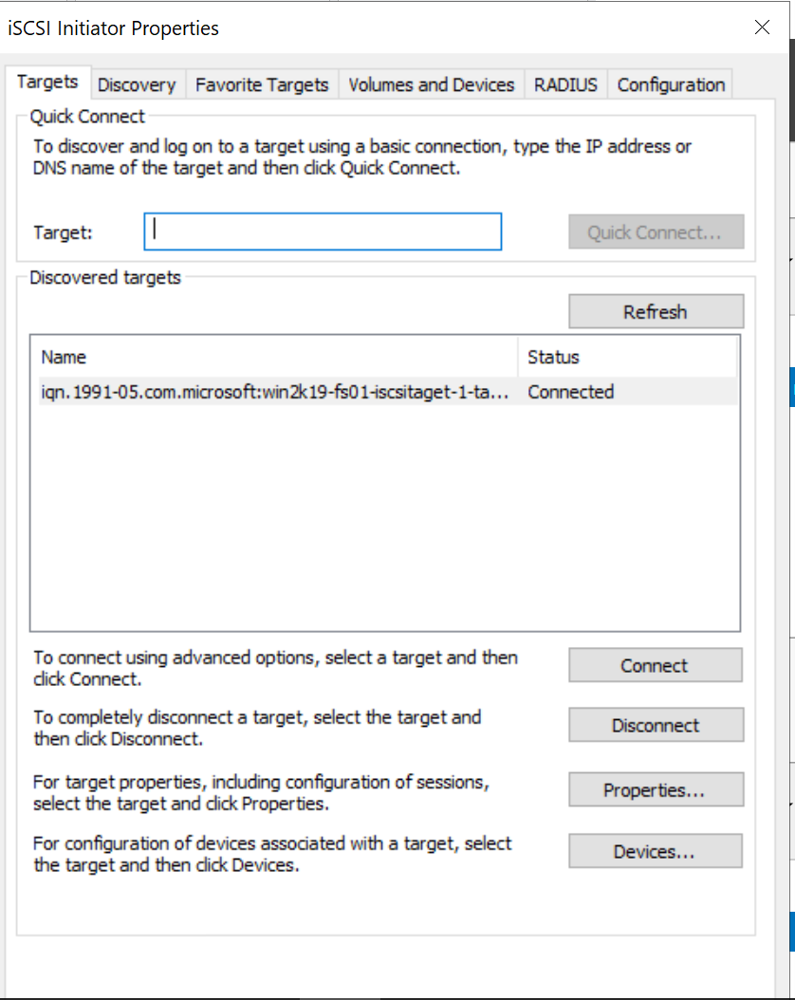

# Installing and Configuring iSCSI Target Server and Initator Server

In this step I will be configuring iSCSI Target Server and iSCSI initiator server 

iSCSI: Internet Small Computer System Interface

- A block protocol that allows you to set up a network storage that allows users and servers to access a remote network drive over a standard TCP/IP network

- Composed of: 
    1.	iSCSI initiator: hardware or software that sends data

    2.	iSCSI target: server that hosts the storage resources that the initiator sends the data to

The iSCSI Target server will be the file server that I have configured in [File Server Configuration](../step_7/README.md "File server configuration").

The iSCSI initiator server will be configured in this step. The name will be WIN2K19-SRV01.

## *Configuring an iSCSI target service on the File server and create a new iSCSI virutal disk*

Install the iSCSI roles, then create and configure the iSCSI virutal disk

1.	Install the iSCSI role on the file server(WIN2K19-FS01) using the add roles and features wizard found in the server manager
    - 	This is a role-based feature installation
    -	The iSCSI target server option will be the one that we need to install
        -	It will be found under server roles, then navigate to file and storage services, and under file and storage services, you will find file and iSCSI services. 
        -	Under file and iSCSI services, you will find the iSCSI target server role as well as iSCSI initator server options
        - Select iSCSI target server

2.	Leave the rest as defaults and install the role

3.	After the installation is completed, go to file and storage services in server manager, and then select iSCSI, which will pop up after the installation

4.	Create an iSCSI virtual disk using the new iSCSI virtual disk wizard

    - 
    -	The F drive used to only have 20GB, but I allocated 40 more GB to it using VMware setting since I thought the only 20GB is too few
    -	I then extended the F drive using disk management of the file server VM so it will take all of the 60GB as F drive. 
5.	Select the F drive as the volume of the iSCSI virtual disk

6. 	The disk name is called vDisk1

7.	I will allocate 25GB of the F drive volume to the iSCSI virtual disk and it will be dynamically expanding, which means that it will not allocate 25GB right off the bat. It will grow as the files are being stored in up until 25GB.

8. 
    -	New iSCSI target because we do not have any existing iSCSI target yet

9. The new iSCSI target name: iSCSITarget-1
    - This is the name that the iSCSI initiator(WIN2K19-SRV01) will connect to for the iSCSI target
    - The IP of the server that will have access to the iSCSI virtual disk will be 192.168.1.138
        1.	**This is an initiator server that I created and added to the domain just for the purpose of making it an iSCSI initiator**
        2. The name of it is WIN2K19-SRV01
            - I did the same iSCSI role-based installation for this server as the file server
            - Installed the iSCSI initator role 

10. Select Add and use IP address to find the initiator server in the add initiator window
    - 
    - 
        - The initator(WIN2K19-SRV01) has been found and added as an iSCSI initiator that can access the iSCSI virtual disk that we are making(vDisk1)

11.	We do not need to create authentication for this initiator

12.	Press create

13. The virutal disk with the name of vDisk1 has been created successfully
    - 
    - 

## *Configure the iSCSI initiator server(WIN2K19-SRV01) and connect the initator and the target server*

Further configure the iSCSI initator and connect it to the iSCSI target server so we can initialize the virutal disk that we set up in the iSCSI target server(vDisk1) onto the initator

1.	The server address is 192.168.1.138, and the name is WIN2K19-SRV01

2.	Go to the iSCSI initiator tool under the tool drop down menu of the server manager

3.	Select yes to start the iSCSI initiator service and the iSCSI initiator properties window will pop up

4.	Put in the IP address of the file server that we just configured as an iSCSI target server and select quick connect
    - The connection will not work at all at first(kept saying target not found), so I then restarted the file server and the connection just magically started working
    - 
    - It is now connected to the iSCSI target server that we set up 

5.	Select the target that was just discovered, and then select connect

6.	We do not have multiple servers connecting via the same path to the iSCSI virtual disk, we do not enable multi-path
    - 

7.	Select ok as we do not need anything more than this configuration right now

8.	Now it is connected as it is confirmed in the file server iSCSI setting
    - 

## *Initalize the virtual iSCSI Disk*

The target server and the initator connection is set up, and it is time to initalize the virutal iSCSI disk so we can actually use it

1.	The initiator server is not seeing the virtual disk yet, and that is because it is not online and it not initialized
    - The iSCSI virutal disk works kinda like a physical disk, adding the disk to the server is not enough, we need to also do the standard disk management procedure so we can use the disk
    - ")

2. Go to disk management and we found that there is an offline disk with 25GB of space
    - 
    - This offline disk is our iSCSI virtual disk

3. That is our virtual disk via iSCSI, and we need to bring it online, initialize it, and then do a new simple volume

4.	Drive letter will be E

5.	Volume label is called Data

6.	It is now ready to be used
    - 
    - 
    - It is now showing up in the file explorer of the initator server, we can now put data in that virtual disk

7.	The iSCSI virtual drive now connected and ready to be used

**The iSCSI target server and initator server are now configured successfully**