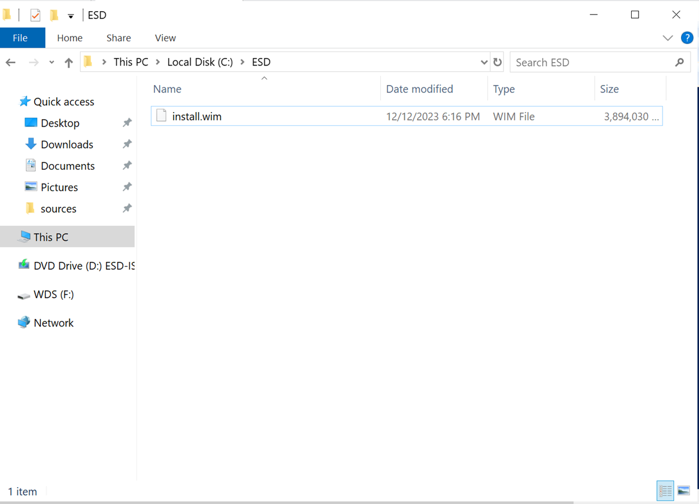

# Troubleshooting servers and resolving issues

Here are the issues that I encountered when setting up and maintaining the domain

Will constantly update, and will update more often if I got bad luck :(

## *Broken domain*

1.	The day after I installed my Read Only Domain Controller, I realized that all of the domain controllers lost network connection.
2.	They can still access the network neighborhood, as they still see each other, however, they cannot access the internet nor ping the router
3.	I restarted the server a couple of times and it did not fix the issue
4.	Possible causes that I think may have caused the issue
    - I think that it is because of the main domain controller that is having issues, therefore it affected the things that happened with the other 2 domain controllers
    - I thought that I may have the DNS set wrong or the static IP address set up wrong
        - I went ahead to have the main domain controller set to DHCP, and it did not fix the issue
        - I went ahead and set the VM network setting from Bridge connection stimulating a LAN environment to NAT connection used to share the host's IP address	
            - The main DC was able to connect to the internet after this fix, however I cannot assign IP addresses as DHCP, and it is not what I wanted for my router
            - After the change, I think the issue is due to the main DC losing connection to the router
    - I suspect that the router may have gotten a firmware update, which may have caused this mess
        - I restarted the router and hoped that it might have saved the domain
        - After the reboot of the router, I also rebooted the servers, only to realize that the main domain controller and the read only controller is out, yet the secondary domain controller is fixed
        - Which means that the main domain controller and the read only controller must have something else done to them that makes that fix not work, as all of these domain controllers are clones of each other.
    - I suspect that it is because of a Windows updates that were installed in these two virtual machines
        - I went ahead and checked the update history of all three, and saw that the main and read only domain controllers have an Windows update while the secondary domain controller does not
        - I reverted those updates to see what happens
        - It did not solve the issue
5.	I cannot think of any issues and any possible fixes anymore, so I gave the FSMO roles to the secondary domain controller, and deleted the primary domain controller and the read only domain controller so we can restart again later on.
    - The FSMO role cannot be transferred since I did not do that before I demoted the primary domain controller to a normal server, now the FSMO roles for the domain is still attached to the former primary domain controller
    - There is no way to add the primary domain controller back since it literally cannot access the domain anymore
    - I just ended up scratching the entire domain and do it all over again
6.	Lesson learned:
    - Always make a snapshot of the current state before you do a Windows update on a server
    - Transfer the FSMO role before demoting the domain controller
    - It is beneficial to restart the router if the entire network is having issues trying to ping the router, it can solve your issue... sometimes

## *Broken domain for the second time*

1.	This time, the same thing happened, where all of the VMs within the domain lost connection to the internet
    - They can ping each other, but not the router
    - I did not install any Windows updates for those servers
    - I restarted all of those VMs to see if it fixed the issue, but it did not
    - I suspect this is a router issue
2.	I went ahead and shut down the VMs as well as restarted the router then restarted the VMs after the internet come back up
    - This time, the VMs in the domain were able to connect to internet just fine
    - However, the VMs were not able to see each other
        - The network name is showing up as Network instead of YCFOREST.LOCAL
        - 
    - This caused the RODC to not able to contact the primary and secondary domain controller, hence I cannot log in to the RODC at all
        - Domain controllers cannot have local administrators, so logging as an local administrator is not an option for me
    - I went on to the Child Domain Controller, Primary and Secondary Domain Controllers and logged in as administrators 
        - I can do that because they are controllers of their domain and they are writeable domain controllers, so everything else have to replicate from them
    - I went to the ethernet network settings from the Local Server section of the Server Manager and disabled the network, and then reenabled it
        - 
        - This allowed the network name to be changed from Network to YCFOREST.LOCAL, and that will allow the VMs to communicate with each other, thus allowing me to login to the Read Only Domain Controller
        - 
    - My domain servers and computers are once again talking to each other and everything is on its merry way
3.	Lesson learned:
    - When there is a domain network issue and you cannot ping the router but everything else within the domain network, it is probably a router issue
        - Identify a safe time and restart the router of the network and it will probably fix the issue as rebooting the router can clear the RAM of the router and end any weird process that might disrupt the network for your domain
    - There is a high chance that after you have restarted your router, your VMs cannot identify the domain network even though now they can go to the internet
        - You can just disable the ethernet that is connected to the router and then reenable the same network again, it will probably fix allow the VMs to identify the domain network again.

## *Domain clients not using the DHCP server that I set up in the primary domain controller as their DHCP server*

1.	After I set up the DHCP server in the primary domain controller, the clients that are using DHCP in the domain are not using it as their DHCP server
2.	But the other devices that are newly added to the network(such as phones that just got joined to the internet using my router but is not a part of the domain that I have set up) is showing up in my DHCP
3.	I think that is because the DHCP is taking all devices that are joining the router and giving them addresses, but is ignoring the ones that are already in the network
4.	Tried disabling and reenabling the network, it did not work, it kept using the router as their DHCP
    - I think it is because the clients are accustomed to the router as the DHCP server since that is what they are using before their network was disabled
        - These clients are using DHCP all these time, I did not assign them any IP addresses statically
5.	I took the clients off of the DHCP option and assigned them static IP addresses, and then removed the static IP address and turn on DHCP for them again
6.	Now the clients have to look for a new DHCP server and is showing in my newly set up DHCP server
7.	Lesson learned
    - Computers that are already using DHCP with the router will not change their DHCP server automatically to the server you have set up
    - You need to assign it a static IP address first and then turn on DHCP so they have to look for a new DHCP server again, and then it will show up in the DHCP server that you have configure... most likely

## *Cloned servers cannot joined the domain due to having the same SID as the domain controller*

1.	I made multiple clones of the original primary domain controller before that VM became a domain controller
    - In fact, it was right after the fresh installation of that VM
2.	When I am trying to set up and join the cloned machine in to the domain, it gave me an error that tells me that this machine has the same SID as the primary domain controller so I cannot join it to the domain
    - SID is called the Security ID, which is a unique identifier that is assigned to any computer, server, user, user groups, or any security principals in an active directory domain
    - Having the same SID can only happen when I cloned a VM from the domain and try to join that VM to the same domain
    - This cannot happen since all machines in a domain should be uniquely identifiable
3.	I need to give it a unique SID, so I used the sysprep generalize command to generalize the cloned machine
    - Now I have to do some of the set up again, but the VM is still intact after the sysprep run
4.	After running sysprep generalize, I can now join the VM to the domain and do what I needed to do
5.	Lesson learned
    - Cloned machines have the same SID as the original machine, and you need to run sysprep to give it a unique SID so you can join the machine into the domain
    - Sysprep generalize is important because it can remove PC-specific information, including the SID from a windows installation so the cloned machine can be used for different PCs while still keeping the same setting as the original machine
    - Sysprep generalize is a crucial step when cloning machine images in a virtual environment
    - It is good practice to always sysprep generalize the cloned VM first before doing anything with that cloned VM or else it may bar you from accomplishing anything

## *Installing the new Window 10 ISO image on the WDS server*

1.	The file will need to be install.wim file, however, current Windows 10 iso does not provide install.wim files anymore, it only provides install.esd
    - We need to convert install.esd to install.wim using the Export-WindowsImage command of PowerShell
    - The install.esd file will be located at the sources folder of the ISO DVD drive
    > Get-WindowsImage -ImagePath "d:\sources\install.esd"

    - This first command gets the OS options within the install.esd file
        - 
        - The ImageIndex will be important because that how we select which image to extract from the install.esd file
2.	I will export the image with the ImageIndex of 7, and create a install.wim file at my esd folder in the C drive

    > Export-WindowsImage -SourceImagePath F:\sources\install.esd -SourceIndex 10 -DestinationImagePath C:\esd\install.wim -CheckIntegrity

    - This command means that I will export the image with the ImageIndex of 7, and create a install.wim file at my esd folder in the C drive
    - 
    - Select this file at the Add image wizard
3.	Name of the image group will be WIN2K19-Image
    - 
        - Adding the image to the WIN2K19-Image group
4. The only Windows image will be Windows 10 Professional N, which is what we extracted from the install.esd file
    - The wim file will not work if it is compressed in the wrong way. When I first extracted it, it was in the wrong form of the wim, which the WDS did not like and threw me an error stating that the file was corrupt
    - I compressed the file again and this time I did the max compression, and the WDS took it
5. Lesson learned:
    - Nowadays, Windows 10 and 11 ISOs only provide esd install files, and you have to extract the intall.wim file from the install.esd file using dism
    - If the install.wim file is not using max compress, there is a chance that the WDS will not like it

## *Newly installed VM unable to get to internet*

1.	I used the Windows Deployment server that I set up to install a new Windows Server VM, the server is in the domain automatically, however, it is also automatically not have internet access despite connected to the network
2.	I tried to assign it a IP address and DNS address statically to see if it fixed the issue, it did not
3.	I tried to use the network troubleshooter to reset the NIC, it did not work
4.	I then thought that it might be the DHCP server that I configured in the primary domain controller(which I have running at the time) is assigning the machine an IP address, which may be conflicted with the IP address I assigned it in the router
    - I then took off the IP address in the DHCP lease
    - Use the troubleshooter to reset the NIC again and let it restart on its on
    - After the restart, the network is finally working and it has internet access
5.	Lesson learned:
    - When something happened that caused the network connection to have issues, using the network troubleshooter is always a good thing, it might just solve the issue for you without much effort on your side